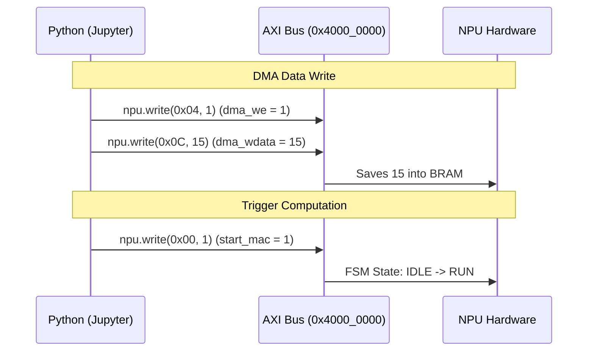

# Full-Stack Integration: AXI4-Lite & PYNQ (Software Control)

This covers the process of wrapping our pure logic circuit (Verilog) with a standard interface, allowing the ARM CPU (Zynq PS) to communicate with it in the real world.

## 1. The Magic of Memory Mapped I/O (MMIO)
The CPU cannot physically press hardware switches. Instead, it utilizes the AXI4-Lite interconnect: **"Writing a value to a specific memory address translates into electrical signals that toggle the hardware switches."**

