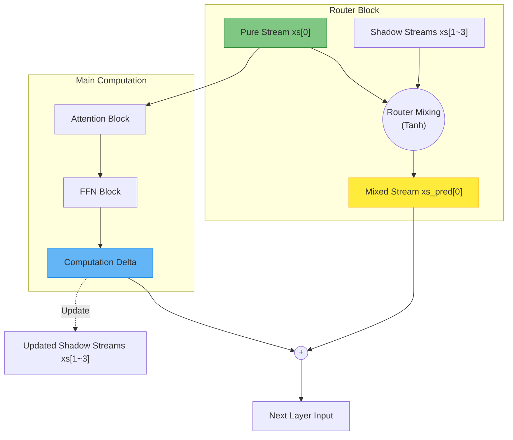

# AltUp 4-Stream Router and Residual Connections

The Gemma 3N architecture employs a sophisticated AltUp 4-Stream processing model, significantly deviating from traditional transformer modality routers. This document details the routing calculation and the unique residual connection strategy.

## The Modality Router: Tanh vs. Softmax

In many architectures, modality routing relies on Softmax to determine the probabilities or mixing ratios among multiple streams. **Gemma 3N Abandons Softmax for this purpose.**

Instead, the Modality Router computes the mixing ratios using a `Tanh` activation function applied after scaling the input by the model dimension.

### The Calculation

The routing weights are determined by:

$$
\mathbf{W}_{route} = \tanh \left( \frac{\text{Norm}(\mathbf{x})}{2048.0} \right) \cdot \mathbf{W}
$$

**Why?**
The scaling step ($ / 2048.0 $) is critical. It normalizes the magnitude based on the feature dimension, preventing the inputs to the `Tanh` function from saturating at the extremes ($ -1 $ or $ 1 $). This ensures a smooth, differentiable gradient and balanced mixing ratios.

```python
# Example Implementation
scaled_x = x_n / 2048.0
route_weights = np.tanh(np.dot(scaled_x, w_router))
```

## Residual Connections: The "Temporary Lens"

A common misconception is that the mixed data stream (often denoted as `xs_pred[0]`) is the primary input that flows into the heavy computation blocks (Attention and FFN). **This is incorrect.**

### The True Flow
1. **Main Computation:** The unmodified, pure original stream `xs[0]` is what enters the Attention and FFN blocks.
2. **The Role of `xs_pred[0]`:** The mixed stream `xs_pred[0]` acts merely as a 'temporary lens'. It bypasses the main computation blocks and is utilized **exclusively at the end of the layer**.
3. **Residual Delta:** At the layer boundary, the changes (deltas) generated by the Attention and FFN blocks (which processed the pure `xs[0]`) are added to `xs_pred[0]` to form the final residual connection. This delta is also used to update the "shadow streams" (`xs[1~3]`).

### Visualization



### Summary of Rules
- **Rule 1:** Use `Tanh(Norm(x) / 2048.0) * W` for routing, never Softmax.
- **Rule 2:** `xs[0]` (Pure) enters Attention/FFN.
- **Rule 3:** `xs_pred[0]` (Mixed) is ONLY used as the base for the final residual addition.
