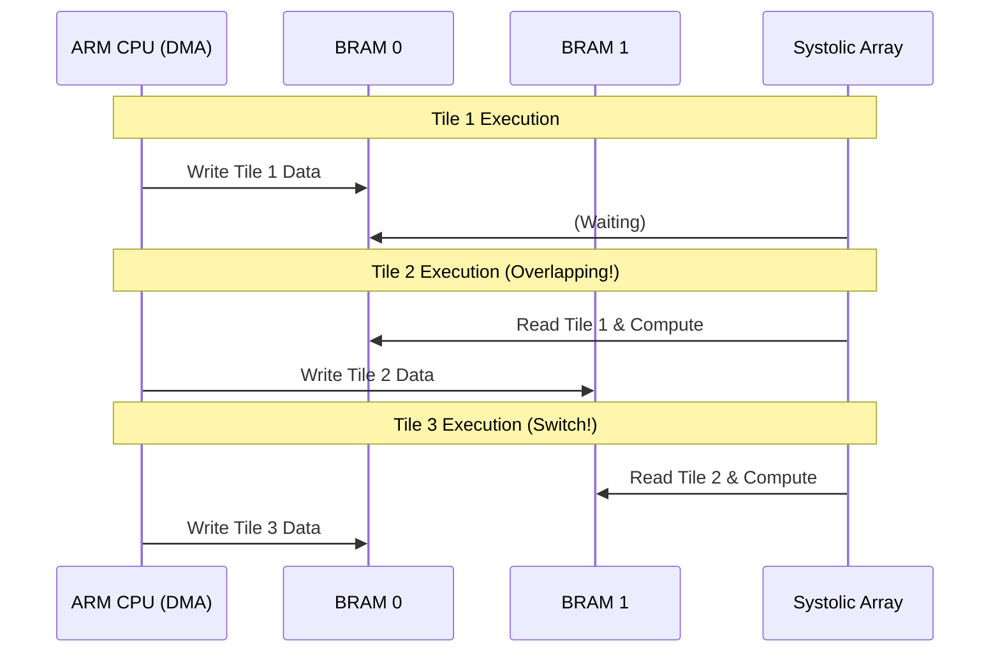
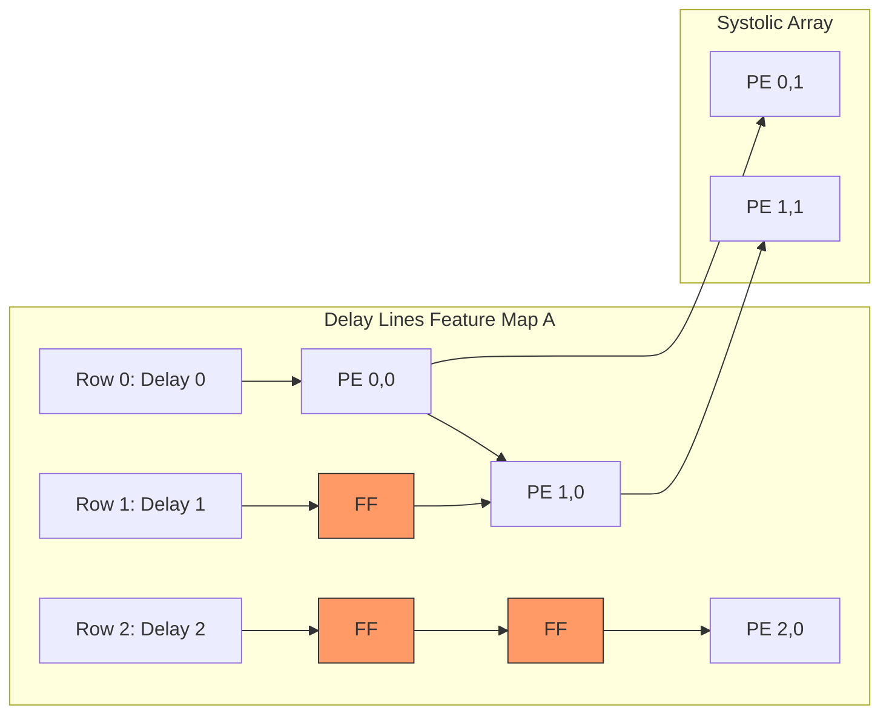
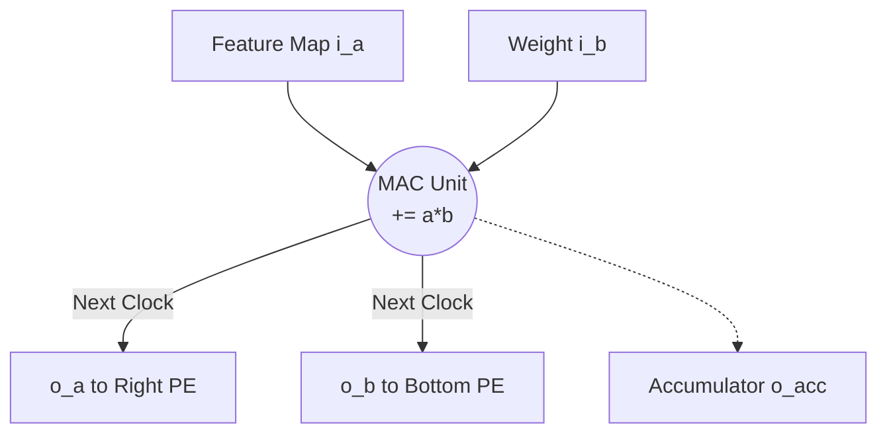

# TinyNPU-Gemma Top-Level Architecture

TinyNPU-Gemma is a custom NPU designed specifically to accelerate the quantized **Gemma 3-4B-IT (E4B) LLM model** on the **Xilinx Kria KV260 FPGA board**. It evolved from an initial 12MP image enhancement project (SwinIR-Light) to focus strictly on maximizing the KV260's hardware resources (1,248 DSP48E2 slices, 144 BRAMs) for large language model inference.

## System Block Diagram & 38-Clock Pipeline Latency

The entire system is divided into the ARM Cortex-A53 CPU (Processing System, PS) and the NPU Core in the FPGA fabric (Programmable Logic, PL). Communication is handled via the AXI4-Lite interface, controlled using Memory Mapped I/O (MMIO).

To minimize latency, TinyNPU-Gemma implements an ultra-deep, fully-pipelined data path ("The 4 Exodia Parts") that executes complex non-linear mathematical operations alongside matrix multiplication in just **38 clock cycles** (approx. 380ns at 100MHz).

```mermaid
%%{init: {'theme': 'base', 'themeVariables': { 'primaryColor': '#e1f5fe', 'primaryBorderColor': '#01579b', 'lineColor': '#01579b', 'fontFamily': 'arial'}}}%%
graph TD
    subgraph "Pipeline Data Path (38-Clock Latency)"
        direction LR
        IN((Input 512-bit<br/>[W:A] Packed)) --> RMS["RMSNorm<br/>(2 Cycles)"]
        RMS --> VSCALE["Vector Scaling<br/>(1 Cycle)"]
        VSCALE --> MAC["32x32 Systolic Array<br/>MAC Engine<br/>(32 Cycles)"]
        MAC --> ACT{"Activation<br/>Select"}
        ACT -- Score --> SM["Softmax<br/>(3 Cycles)"]
        ACT -- Value --> GELU["GeLU<br/>(1 Cycle)"]
        SM --> OUT((Output))
        GELU --> OUT
    end
    
    style RMS fill:#ffe0b2,stroke:#e65100
    style VSCALE fill:#fff9c4,stroke:#fbc02d
    style MAC fill:#c8e6c9,stroke:#1b5e20
    style SM fill:#f8bbd0,stroke:#ad1457
    style GELU fill:#e1bee7,stroke:#4a148c
```

## System Block Diagram

The entire system is divided into the ARM Cortex-A9 CPU (Processing System, PS) and the NPU Core in the FPGA fabric (Programmable Logic, PL). Communication is handled via the AXI4-Lite interface, controlled using Memory Mapped I/O (MMIO).

### The 4 Exodia Parts (Hardware Accelerators)

1. **32x32 Systolic Array MAC Engine:** Scaled down from a theoretical 64x64 design to exactly 32x32 to perfectly fit the KV260's DSP limit (uses 1,024 out of 1,248 available DSP48E2 slices). Executes signed 8-bit multiplications with 16/32-bit accumulations to prevent overflow, utilizing a wavefront propagation structure for maximum data reuse.
2. **1-Clock RMSNorm Accelerator (`rmsnorm_inv_sqrt.sv`):** Replaces computationally expensive $1/\sqrt{x}$ iterative divisions with a 1024-segment Piecewise Linear (PWL) approximation. Extracts slope and intercept from BRAM and calculates $y = ax + b$ within a single DSP clock cycle.
3. **3-Clock Softmax Accelerator (`softmax_exp_unit.sv`):** Sidesteps Taylor series calculations by applying Base-2 conversion ($e^x = 2^{x \cdot \log_2 e}$). The integer portion is handled instantly via bit-shifts, while the fractional portion uses a tiny 1024-segment LUT, slashing the cycle cost down to just 3 clocks.
4. **1-Clock GeLU Accelerator (`gelu_lut.sv`):** Bypasses the complex $\text{tanh}$ formula by implementing a 64KB Full-ROM lookup table optimized for 16-bit inputs, resolving the non-linear activation in a single clock cycle.

## Core Features & Data Path Strategy

**512-bit Wide Data Path (Packing):** To maximize memory bandwidth from the BRAM, TinyNPU utilizes a 512-bit wide read bus. A single BRAM slot contains exactly 512 bits, strategically packed as: `[Upper 256-bit Weights (B) : Lower 256-bit Activations (A)]`.

**Memory Mapped I/O (AXI4-Lite):** The CPU can control NPU registers and inject data into the BRAM simply by writing to specific memory addresses.

**Double Buffering (Ping-Pong BRAM):** Applies a latency hiding technique that overlaps data transmission (DMA) with NPU computation, effectively eliminating memory-bound bottlenecks.

**Data Skewing via Delay Lines:** Utilizes D-Flip-Flop-based shift registers to create the physical delay required for the wavefront execution in the Systolic Array, minimizing the complexity of the FSM controller.


---

### 2. `Ping-Pong BRAM Controller.md` (Double Buffering)

# Ping-Pong BRAM Controller

Block RAM (BRAM) acts as an ultra-fast, on-chip L1 Cache, providing data to the NPU Processing Elements (PEs) without a single clock cycle of delay.

## The Necessity of Ping-Pong (Double Buffering)
The data fetching speed from main memory (DDR) is significantly slower than the NPU's computation speed. If a single BRAM is used, the computation cores will fall into an idle state while waiting for the next data tile. 
To solve this, a Ping-Pong structure utilizing two alternating BRAMs is adopted.


Hardware Operation Mechanism
When ping_pong_sel is 0: The external DMA writes to bram_0, while the NPU reads from bram_1.

When ping_pong_sel is 1: The switch toggles; the DMA writes to bram_1, while the NPU reads from bram_0.

This switching is automatically managed by the FSM every time a new tile computation begins.


---

### 3. `systolic_NxN.md` (Scalable Array & Delay Lines)

# Scalable NxN Systolic Array & Delay Lines

This is the core computation array of the TinyNPU. Through parameterized design, the number of cores (NxN) can be freely scaled during compile time.

## Data Skewing and Delay Lines (Shift Registers)
In a Systolic Array, data shifts one step to the right and bottom in each clock cycle. To ensure that data perfectly aligns without overlapping (Wavefront execution), a hardware-level 'departure delay' must be enforced.

To achieve this, **Delay Line** modules—composed of cascaded D-Flip-Flops—are placed before the input ports of the array.


FSM Abstraction: The FSM does not need to calculate intricate timings; it simply fires all data simultaneously by asserting fire_valid = 1.

Automated Wavefront: The physical delay circuits (FFs) act as queues, injecting data into the core array with a 1-clock, 2-clock sequential delay.

Hardware For-Loops: Internal 2D-array wire routing is fully automated using SystemVerilog generate for blocks.


---

### 4. `PE Unit.md` (Processing Element)

# Processing Element (PE Unit)

The PE Unit is the smallest fundamental computation core comprising the Systolic Array. It performs a MAC (Multiply-Accumulate) operation every clock cycle and forwards the incoming data to adjacent PEs.

## Interfaces (Ports)
- **Input**: `i_a` (from the left), `i_b` (from the top), `i_valid` (computation trigger).
- **Output**: `o_a` (passed to the right), `o_b` (passed to the bottom), `o_valid` (trigger for next PEs), `o_acc` (accumulated result).

## Operation Structure (Pipeline)
1. Operations are only executed when the `i_valid` signal is High (1).
2. The `o_acc <= o_acc + (i_a * i_b)` MAC operation is performed within a single clock cycle.
3. The data received in the current cycle (`i_a`, `i_b`) is stored in internal D-Flip-Flop registers and pushed out to `o_a`, `o_b` at the next clock's positive edge (posedge).


---

### 5. `Testbench.md` (Verification)

# Testbench & Verification

To verify the functionality and timing of the NPU core, a top-down integrated simulation approach is employed.

## Verification Scenarios (`tb_npu_core_top_NxN.sv`)
This testbench emulates the exact process of the ARM CPU and DMA controlling the NPU on an actual Zynq board.

1. **Phase 1: DMA Data Load (Host to Device)**
   - Manipulates the `dma_we`, `dma_addr`, and `dma_wdata` signals to sequentially write external data into BRAM_0.
2. **Phase 2: Kernel Launch & FSM Trigger**
   - Asserts the `start_mac` signal High for 1 clock cycle to awaken the FSM inside the NPU.
   - Observes the FSM reading data from the BRAM, passing it through the Delay Lines, and shooting it into the Systolic Array in a Wavefront pattern.
3. **Phase 3: Continuous Streaming (Latency Hiding Verification)**
   - Simulates a Double Buffering scenario where the NPU reads and computes from BRAM_0 while the DMA simultaneously writes the next tile's data to BRAM_1, verifying the absence of memory bottlenecks.

## Waveform Checkpoints
- By monitoring the simulation scopes, it is confirmed that the data from the fire