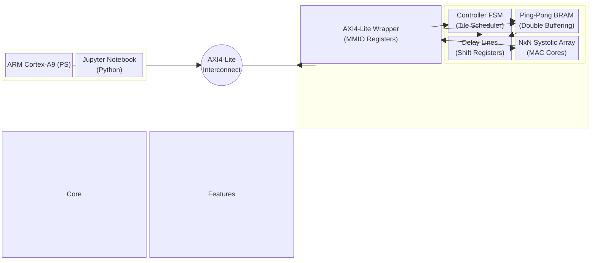
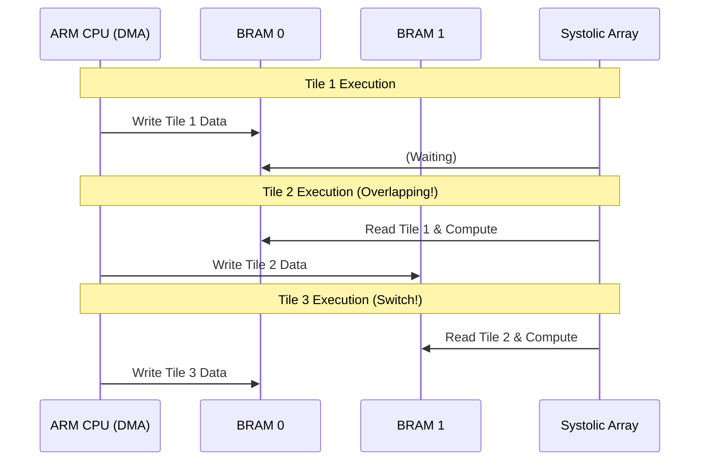
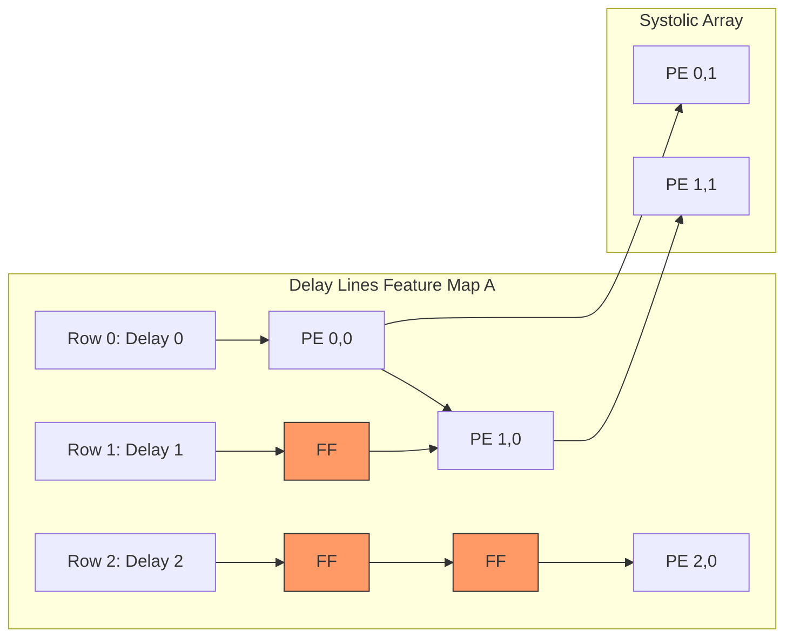
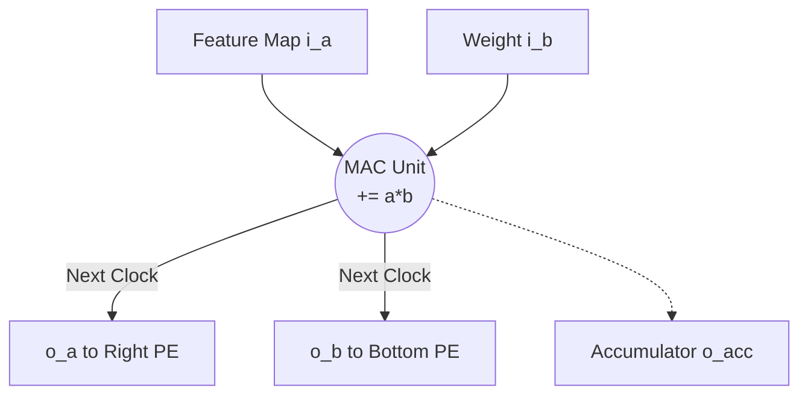

# TinyNPU-RTL Top-Level Architecture

TinyNPU is a scalable NxN Systolic Array-based matrix multiplication accelerator designed to operate on the Xilinx Zynq-7000 SoC (PYNQ-Z2) environment.

## System Block Diagram

The entire system is divided into the ARM Cortex-A9 CPU (Processing System, PS) and the NPU Core in the FPGA fabric (Programmable Logic, PL). Communication is handled via the AXI4-Lite interface, controlled using Memory Mapped I/O (MMIO).

Memory Mapped I/O (AXI4-Lite): The CPU can control NPU registers and inject data into the BRAM simply by writing to specific memory addresses.

Double Buffering (Ping-Pong BRAM): Applies a latency hiding technique that overlaps data transmission (DMA) with NPU computation, effectively eliminating memory-bound bottlenecks.

Data Skewing via Delay Lines: Utilizes D-Flip-Flop-based shift registers to create the physical delay required for the wavefront execution in the Systolic Array, minimizing the complexity of the FSM controller.

Scalable NxN Design: Designed using SystemVerilog's generate statements, allowing flexible expansion of core counts (e.g., 4x4, 8x8, 16x16) simply by modifying the ARRAY_SIZE parameter at compile time.

---

### 2. `Ping-Pong BRAM Controller.md` (Double Buffering)

# Ping-Pong BRAM Controller

Block RAM (BRAM) acts as an ultra-fast, on-chip L1 Cache, providing data to the NPU Processing Elements (PEs) without a single clock cycle of delay.

## The Necessity of Ping-Pong (Double Buffering)
The data fetching speed from main memory (DDR) is significantly slower than the NPU's computation speed. If a single BRAM is used, the computation cores will fall into an idle state while waiting for the next data tile. 
To solve this, a Ping-Pong structure utilizing two alternating BRAMs is adopted.

Hardware Operation Mechanism
When ping_pong_sel is 0: The external DMA writes to bram_0, while the NPU reads from bram_1.

When ping_pong_sel is 1: The switch toggles; the DMA writes to bram_1, while the NPU reads from bram_0.

This switching is automatically managed by the FSM every time a new tile computation begins.

---

### 3. `systolic_NxN.md` (Scalable Array & Delay Lines)

# Scalable NxN Systolic Array & Delay Lines

This is the core computation array of the TinyNPU. Through parameterized design, the number of cores (NxN) can be freely scaled during compile time.

## Data Skewing and Delay Lines (Shift Registers)
In a Systolic Array, data shifts one step to the right and bottom in each clock cycle. To ensure that data perfectly aligns without overlapping (Wavefront execution), a hardware-level 'departure delay' must be enforced.

To achieve this, **Delay Line** modules—composed of cascaded D-Flip-Flops—are placed before the input ports of the array.

FSM Abstraction: The FSM does not need to calculate intricate timings; it simply fires all data simultaneously by asserting fire_valid = 1.

Automated Wavefront: The physical delay circuits (FFs) act as queues, injecting data into the core array with a 1-clock, 2-clock sequential delay.

Hardware For-Loops: Internal 2D-array wire routing is fully automated using SystemVerilog generate for blocks.

---

### 4. `PE Unit.md` (Processing Element)

# Processing Element (PE Unit)

The PE Unit is the smallest fundamental computation core comprising the Systolic Array. It performs a MAC (Multiply-Accumulate) operation every clock cycle and forwards the incoming data to adjacent PEs.

## Interfaces (Ports)
- **Input**: `i_a` (from the left), `i_b` (from the top), `i_valid` (computation trigger).
- **Output**: `o_a` (passed to the right), `o_b` (passed to the bottom), `o_valid` (trigger for next PEs), `o_acc` (accumulated result).

## Operation Structure (Pipeline)
1. Operations are only executed when the `i_valid` signal is High (1).
2. The `o_acc <= o_acc + (i_a * i_b)` MAC operation is performed within a single clock cycle.
3. The data received in the current cycle (`i_a`, `i_b`) is stored in internal D-Flip-Flop registers and pushed out to `o_a`, `o_b` at the next clock's positive edge (posedge).

---

### 5. `Testbench.md` (Verification)

# Testbench & Verification

To verify the functionality and timing of the NPU core, a top-down integrated simulation approach is employed.

## Verification Scenarios (`tb_npu_core_top_NxN.sv`)
This testbench emulates the exact process of the ARM CPU and DMA controlling the NPU on an actual Zynq board.

1. **Phase 1: DMA Data Load (Host to Device)**
   - Manipulates the `dma_we`, `dma_addr`, and `dma_wdata` signals to sequentially write external data into BRAM_0.
2. **Phase 2: Kernel Launch & FSM Trigger**
   - Asserts the `start_mac` signal High for 1 clock cycle to awaken the FSM inside the NPU.
   - Observes the FSM reading data from the BRAM, passing it through the Delay Lines, and shooting it into the Systolic Array in a Wavefront pattern.
3. **Phase 3: Continuous Streaming (Latency Hiding Verification)**
   - Simulates a Double Buffering scenario where the NPU reads and computes from BRAM_0 while the DMA simultaneously writes the next tile's data to BRAM_1, verifying the absence of memory bottlenecks.

## Waveform Checkpoints
- By monitoring the simulation scopes, it is confirmed that the data from the fire