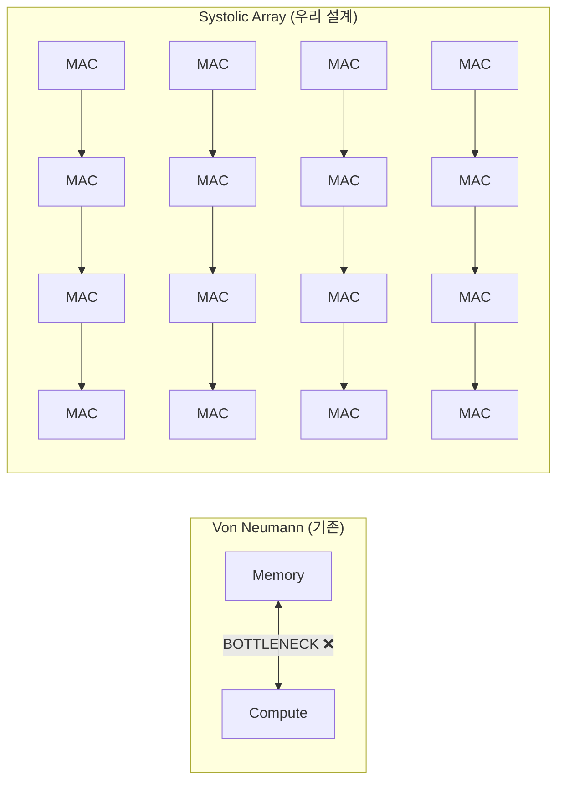
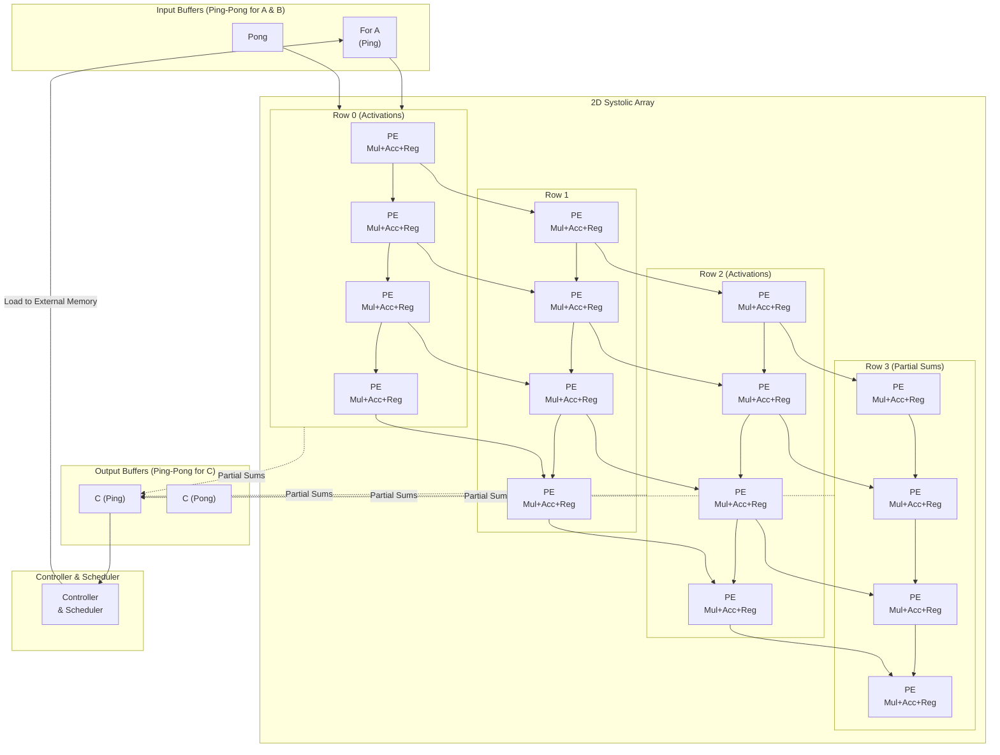

# TinyNPU-RTL 전체 아키텍처

## 1. 왜 Systolic Array인가? (Edge AI Acceleration)

기존 Von Neumann 구조는 CPU가 연산할 때마다 메모리에서 데이터를 가져와야 하는 **Memory Bottleneck** 문제가 있다.



Systolic Array는 데이터를 파도(wavefront)처럼 MAC 격자를 흘려보내며, 내부 레지스터를 통해 **메모리 접근 없이** 데이터를 재사용한다. 이것이 Google TPU와 Apple Neural Engine의 핵심 원리다.

---

## 2. 전체 시스템 구조 (Top-Level View)

세 모듈이 파이프라인으로 협력한다:


각 단계는 클럭 파이프라인으로 겹쳐 실행된다:

```
clk_a  ┌─┐ ┌─┐ ┌─┐ ┌─┐ ┌─┐ ┌─┐     ← DDR → DMA
clk_b      └──X──┘  └──X──┘          ← DMA → BRAM
clk_c           └──X──┘  └──X──┘     ← BRAM 교대 쓰기/읽기
clk_d                └──X──┘  └──    ← Systolic 파이프라인 연산
```

### 각 모듈 역할 요약

| 모듈 | CUDA 비유 | 역할 |
|------|-----------|------|
| `simple_bram` | L1 Cache / Shared Memory | 256×8bit 동기식 SRAM. 주소 입력 후 **다음 클럭**에 데이터 출력 (1사이클 레이턴시) |
| `ping_pong_bram` | Double Buffering | BRAM 2개를 MUX로 교번. DMA 쓰기 + NPU 읽기 **동시에** 수행 |
| `pe_unit` | CUDA Core (MAC) | 곱셈(조합논리) + 누산(순차논리). 데이터를 오른쪽·아래쪽 PE로 포워딩 |
| `systolic_2x2` | SM (Streaming Multiprocessor) | 4개의 PE를 2×2 격자로 연결. 파도(wavefront) 방식으로 행렬 곱 수행 |

---

## 3. Systolic Array 전체 구조 (4×4 확장 개념도)



**Systolic Array:** Efficient parallel processing with data reuse.  
**Ping-Pong Buffers:** Hide memory latency by overlapping computation and data transfer.  
**Timing:** Computation and data loading occur simultaneously in alternate buffers.

---

## 4. Ping-Pong 타이밍 (3단계 파이프라인)

```mermaid
gantt
    title Ping-Pong Buffer Operation Timeline
    dateFormat X
    axisFormat %s

    section Phase 1
    Load Ping Buffers      :a1, 0, 4

    section Phase 2
    Compute on Ping        :a2, 3, 7
    Load Pong Buffers      :a3, 3, 7

    section Phase 3
    Compute on Pong        :a4, 6, 10
    Load Ping (Next tile)  :a5, 6, 10
```



| 단계 | DMA (쓰기) | Systolic (읽기) |
|------|------------|-----------------|
| Phase 1 | Ping 버퍼 로드 | (대기) |
| Phase 2 | Pong 버퍼 로드 | Ping 버퍼로 연산 |
| Phase 3 | Ping 버퍼 로드 (다음 타일) | Pong 버퍼로 연산 |

---

## 5. 하드웨어 사양

| 항목 | 값 |
|------|----|
| **Clock Speed** | 100MHz (10ns Period) |
| **Precision** | 8-bit Input / 16-bit Accumulator |
| **Platform** | PYNQ-Z2 (Zynq-7000, xc7z020clg400-1) |
| **Language** | SystemVerilog |
| **Array Size** | 2×2 (파라미터로 NxN 확장 가능) |
| **BRAM Depth** | 256 (ADDR_WIDTH=8) |

`in_valid`가 High가 된 후 `out_valid`까지 파이프라인 레이턴시가 존재하며, 파이프라인 내부에 남아있는 데이터는 valid=0 이후에도 끝까지 처리된다 (Pipeline Flush).

---

## 6. 핵심 설계 원칙 총정리

이 4개의 모듈이 함께 → **AI 행렬 곱셈 가속기** 완성:

```mermaid
mindmap
  root((TinyNPU))
    MAC / pe_unit
      AI 연산의 99%는 곱셈 + 누산
      i_valid로 유효 데이터만 처리
      조합논리(곱) + 순차논리(누산)
    더블 버퍼링 / ping_pong_bram
      2개 메모리를 번갈아 사용
      DMA 쓰기 + NPU 읽기 동시
      처리량 2배
    Systolic 흐름 / systolic_2x2
      데이터가 파도처럼 PE 격자를 흘러감
      valid 신호가 파도의 타이밍 제어
    동기식 설계 / simple_bram
      모든 동작이 클럭 엣지에서 발생
      동기 BRAM은 1사이클 레이턴시 반드시 고려
```

> 이 구조가 바로 **Google TPU**, **Apple Neural Engine**의 기본 원리 — 규모만 수백~수천 배 클 뿐.