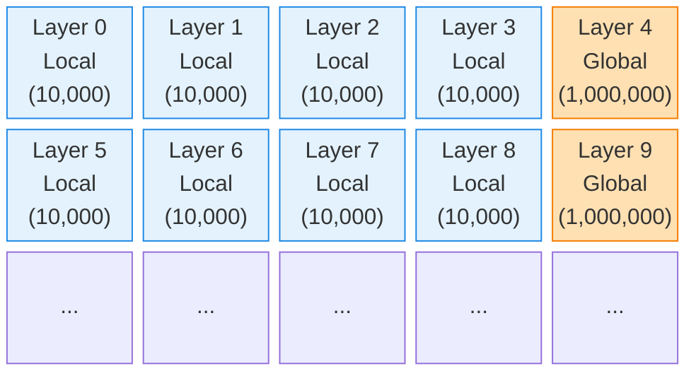

# Attention and RoPE Constraints in Gemma 3N

The Attention mechanism and the Rotary Position Embedding (RoPE) in the Gemma 3N architecture introduce critical changes compared to standard transformer models and previous Gemma iterations. This document outlines the removal of scaling factors and the implementation of alternating RoPE theta values.

## Attention Scaling and Softcap: Completely Removed

In standard attention mechanisms, after the Dot Product of the Query ($ \mathbf{Q} $) and Key ($ \mathbf{K} $) matrices, the resulting scores are typically scaled down by dividing by the square root of the head dimension (e.g., $ / \sqrt{256} $). Additionally, previous Gemma models utilized a `Softcap` (often set to 50.0) to bound the attention logits and final logits to prevent extreme values before the Softmax operation.

**In Gemma 3N, both of these are completely abolished.**

### The New Rule
- **No Scaling:** The Attention Score is exactly $ \mathbf{Q} \cdot \mathbf{K}^T $. Do not divide by $ \sqrt{256} $.
- **No Softcap:** Do not apply any Softcap function to the Attention Logits or the Final Logits.

```python
# Old, Incorrect Way
# attn_weights = np.dot(Q, K.T) / np.sqrt(256)
# attn_weights = softcap(attn_weights, 50.0)

# Gemma 3N Correct Way
attn_weights = np.dot(Q, K.T)
```

## Dynamic Alternating RoPE Theta

Rotary Position Embedding (RoPE) typically uses a fixed `theta_base` (e.g., 10,000 or 1,000,000) across all layers of the transformer. Gemma 3N breaks this convention by employing an **Alternating Theta Base** strategy.

### The 5-Layer Cycle Pattern

The `theta_base` changes dynamically in a repeating 5-layer cycle pattern: `[Local, Local, Local, Local, Global]`.

- **Local Layers (Layers 0, 1, 2, 3):** Use a `theta_base` of **10,000**. This focuses the attention on short-range, local context.
- **Global Layer (Layer 4):** Uses a `theta_base` of **1,000,000**. This allows the model to capture long-range, global context across the entire sequence.
- **Repeat:** This pattern repeats for all 35 layers (e.g., Layer 5 is Local again, Layer 9 is Global).

### Visualization



By alternating the RoPE theta, the model efficiently balances its ability to understand immediate syntactic structures while maintaining a broad semantic understanding over massive context windows.
