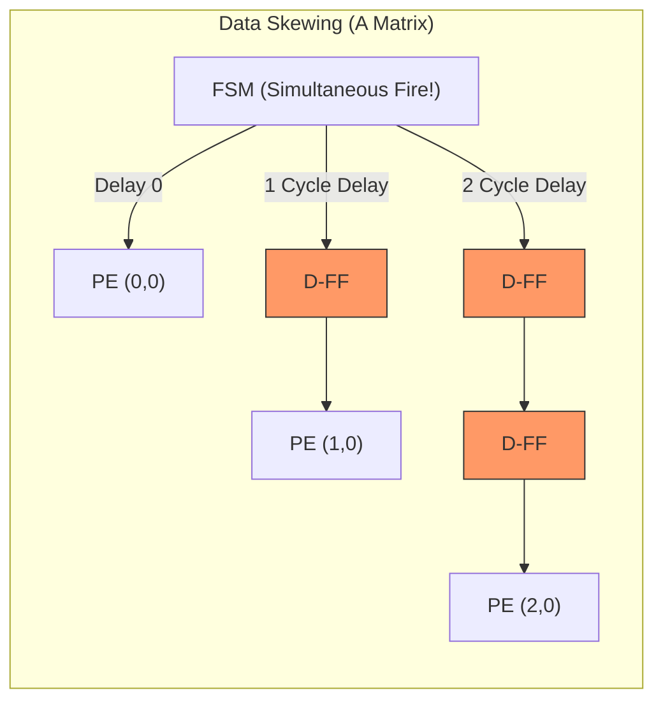

### 3. `Data_Skewing_Delay_Line.md` (The secret of Wavefront execution)

# Data Skewing & Delay Line (Wavefront Execution)

## 1. Why Do We Need Delay?
In a Systolic Array, data shifts one step to the right and bottom in each clock cycle. If we inject the A-matrix data into all rows 'simultaneously' without any delay, the PEs at the bottom will compute with garbage values since the partial sums from the top haven't arrived yet.

To create a proper **Diagonal Wavefront**, **data destined for lower rows and rightmost columns must depart later.**

## 2. Shift Register (Delay Line) Structure
Calculating these precise timings via software-like FSM counters creates massive control complexity. Instead, we implemented physical delay circuits by cascading D-Flip-Flops (D-FF) like a conveyor belt.

