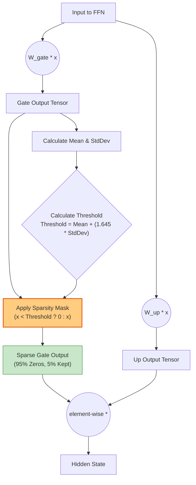

# Feed-Forward Network (FFN) Sparsity

To achieve extreme optimization, Gemma 3N introduces a novel **Gaussian Top-K Sparsity** mechanism specifically targeted at the Feed-Forward Network (FFN) blocks of the early layers.

## Gaussian Top-K Sparsity (0.95)

For the first 10 layers (Layer 0 through Layer 9), the model enforces extreme sparsity on the output of the FFN Gate projection. It retains only the top 5% of the most active neurons, forcefully zeroing out the remaining 95%.

### How It Works

Instead of using a computationally expensive global sorting algorithm to find the absolute top 5% values, Gemma 3N utilizes a statistical approximation based on a Gaussian distribution:

1. **Calculate Statistics:** Compute the mean ($ \mu $) and standard deviation ($ \sigma $) of the Gate output tensor.
2. **Determine Threshold:** Assume the activations follow a normal distribution. The threshold for the top 5% is statistically approximated as $ \mu + 1.645 \cdot \sigma $ (where 1.645 is the Z-score for the 95th percentile).
3. **Filter (ReLU):** Any value falling below this calculated threshold is set to zero (similar to a strict ReLU activation with a dynamic bias). Values above the threshold are kept.

### Visualizing the Pipeline

### Advantages

- **Extreme Computation Reduction:** Since 95% of the hidden dimension becomes zero, subsequent element-wise multiplications and downstream matrix operations (like the Down projection) can skip massive amounts of computation, yielding significant speedups.
- **Hardware Friendly:** The statistical Gaussian approach eliminates the need for sorting (which is notoriously difficult and slow on GPUs/NPUs), replacing it with simple reduce operations (Mean/Variance) and a scalar comparison.

*Note: This extreme sparsity is only applied to Layers 0 through 9. Layers 10 to 34 process the FFN normally without this specific Gaussian Top-K filtering.*
