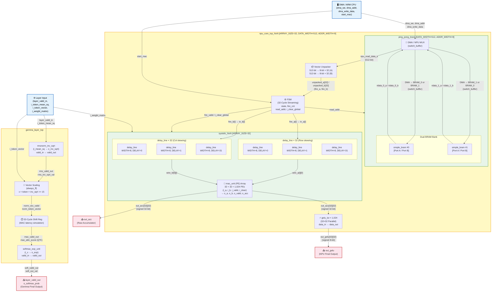

```mermaid
flowchart TB
    %% ============================================================
    %% External Inputs
    %% ============================================================
    DMA["🖥️ DMA / ARM CPU\n(dma_we, dma_addr,\ndma_write_data,\nstart_mac)"]
    LAYER_IN["🌐 Layer Input\n(layer_valid_in,\ni_token_mean_sq,\ni_token_vector,\ni_weight_matrix)"]

    %% ============================================================
    %% TOP: npu_core_top_NxN
    %% ============================================================
    subgraph NPU_TOP["npu_core_top_NxN  [ARRAY_SIZE=32, DATA_WIDTH=512, ADDR_WIDTH=9]"]
        direction TB

        subgraph PING_PONG["ping_pong_bram  [DATA_WIDTH=512, ADDR_WIDTH=9]"]
            direction TB
            MUX["🔀 DMA / NPU MUX\n(switch_buffer)"]
            subgraph BRAMs["Dual BRAM Bank"]
                direction LR
                BRAM0["simple_bram #0\n[Port A / Port B]"]
                BRAM1["simple_bram #1\n[Port A / Port B]"]
            end
            MUX -->|"DMA → BRAM_0 or BRAM_1\n(switch_buffer)"| BRAM0
            MUX -->|"DMA → BRAM_1 or BRAM_0\n(switch_buffer)"| BRAM1
            BRAM0 -->|"rdata_0_a / rdata_0_b"| MUX
            BRAM1 -->|"rdata_1_a / rdata_1_b"| MUX
        end

        FSM["⚙️ FSM\n(32-Cycle Streaming)\nstate, fire_cnt\nread_addr, i_clear_global"]

        UNPACK["📦 Vector Unpacker\n512-bit → 8-bit × 32 (A)\n512-bit → 8-bit × 32 (B)"]

        subgraph SYSTOLIC["systolic_NxN  [ARRAY_SIZE=32]"]
            direction TB

            subgraph DELAY_ROW["delay_line × 32  (Row skewing)"]
                DR0["delay_line\nWIDTH=8, DELAY=0"]
                DR1["delay_line\nWIDTH=8, DELAY=1"]
                DRN["delay_line\nWIDTH=8, DELAY=31"]
                DR0 ~~~ DR1 ~~~ DRN
            end

            subgraph DELAY_COL["delay_line × 32  (Col skewing)"]
                DC0["delay_line\nWIDTH=8, DELAY=0"]
                DC1["delay_line\nWIDTH=8, DELAY=1"]
                DCN["delay_line\nWIDTH=8, DELAY=31"]
                DC0 ~~~ DC1 ~~~ DCN
            end

            MAC_ARRAY["🔲 mac_unit (PE) Array\n32 × 32 = 1,024 PEs\n(i_a, i_b, i_valid, i_clear)\n→ o_a, o_b, o_valid, o_acc"]
            DELAY_ROW -->|"wire_a[i][0]"| MAC_ARRAY
            DELAY_COL -->|"wire_b[0][i]"| MAC_ARRAY
        end

        GELU["⚡ gelu_lut × 1,024\n(32×32 Parallel)\ndata_in → data_out"]

        %% Internal connections
        FSM -->|"read_addr"| PING_PONG
        MUX -->|"npu_read_data_a\n(512-bit)"| UNPACK
        UNPACK -->|"unpacked_a[32] / unpacked_b[32]\n(fire_a, fire_b)"| FSM
        FSM -->|"fire_a[i] → in_a[i]"| DELAY_ROW
        FSM -->|"fire_b[i] → in_b[i]"| DELAY_COL
        FSM -->|"fire_valid / i_clear_global"| SYSTOLIC
        MAC_ARRAY -->|"out_acc[32][32]\n(signed 32-bit)"| GELU
    end

    %% ============================================================
    %% TOP: gemma_layer_top
    %% ============================================================
    subgraph GEMMA["gemma_layer_top"]
        direction TB

        RMS["rmsnorm_inv_sqrt\n(i_mean_sq → o_inv_sqrt)\nvalid_in → valid_out"]

        SCALE["📐 Vector Scaling\n(always_ff)\nx = token × inv_sqrt >> 15"]

        SHIFT["⏱️ 32-Cycle Shift Reg\n(MAC latency simulation)"]

        SOFT["softmax_exp_unit\n(i_x → o_exp)\nvalid_in → valid_out"]

        RMS -->|"rms_valid_out\nrms_inv_sqrt_val"| SCALE
        SCALE -->|"norm_vec_valid\nnorm_token_vector"| SHIFT
        SHIFT -->|"mac_valid_out\nmac_attn_score (Q*K)"| SOFT
    end

    %% ============================================================
    %% External connections
    %% ============================================================
    DMA -->|"dma_we, dma_addr\ndma_write_data"| MUX
    DMA -->|"start_mac"| FSM

    LAYER_IN -->|"layer_valid_in\ni_token_mean_sq"| RMS
    LAYER_IN -->|"i_token_vector"| SCALE
    LAYER_IN -->|"i_weight_matrix"| SYSTOLIC

    %% ============================================================
    %% Outputs
    %% ============================================================
    GELU -->|"out_gelu[32][32]\n(signed 8-bit)"| OUT_GELU["📤 out_gelu\n(NPU Final Output)"]
    MAC_ARRAY -->|"out_acc[32][32]\n(signed 32-bit)"| OUT_ACC["📤 out_acc\n(Raw Accumulator)"]
    SOFT -->|"soft_valid_out\nsoft_out_val"| OUT_LAYER["📤 layer_valid_out\no_softmax_prob\n(Gemma Final Output)"]

    %% ============================================================
    %% Styling
    %% ============================================================
    classDef topmod fill:#fff9c4,stroke:#f9a825,stroke-width:2px
    classDef submod fill:#e8f5e9,stroke:#388e3c,stroke-width:1.5px
    classDef extmod fill:#e3f2fd,stroke:#1565c0,stroke-width:2px,color:#000
    classDef outmod fill:#fce4ec,stroke:#c62828,stroke-width:2px

    class NPU_TOP,GEMMA topmod
    class PING_PONG,SYSTOLIC submod
    class DMA,LAYER_IN extmod
    class OUT_GELU,OUT_ACC,OUT_LAYER outmod
```