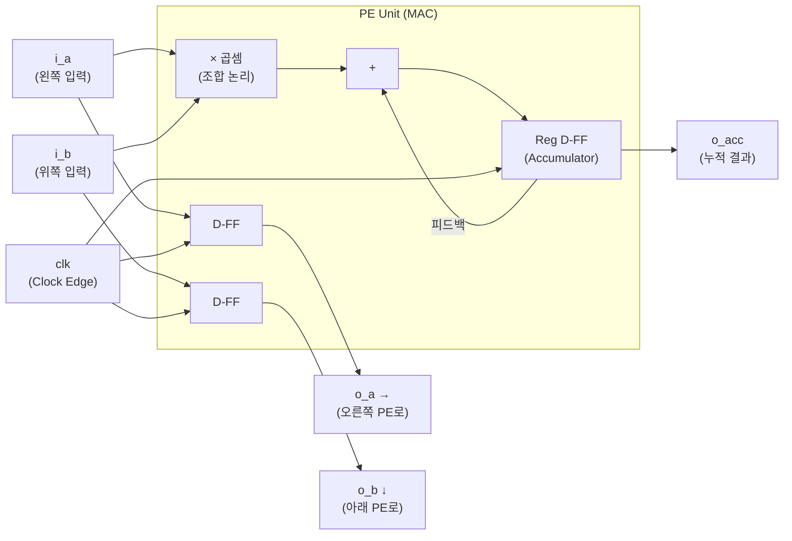
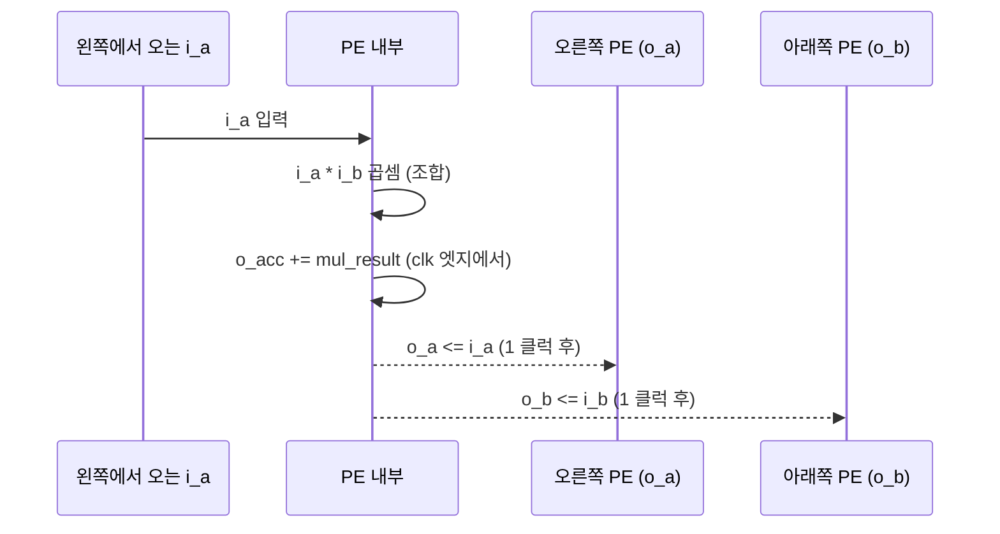

# pe_unit — MAC 연산기 (연산의 최소 단위)

## 1. 개요

PE(Processing Element)는 NPU의 **Atomic Unit**이다. 하나의 PE는 단 하나의 일만 한다: 입력받은 두 수를 곱하고, 그 결과를 계속 더해나가는 것. 이것이 MAC(Multiply-ACcumulate)이다.

AI 연산의 99%는 결국 이 `곱셈 + 누산`이다.

---

## 2. 내부 구조



### Combinational Logic (조합 논리)
곱셈은 클럭과 무관하게 입력이 바뀌면 **즉시** 결과가 나온다.
```systemverilog
assign mul_result = i_a * i_b; // 클럭 없이 즉시 계산
```

### Sequential Logic (순차 논리)
누산(Accumulate) 결과는 클럭 엣지(Clock Edge)에 동기화되어 레지스터에 저장된다.
```systemverilog
always_ff @(posedge clk or negedge rst_n) begin
    if (!rst_n)
        o_acc <= 16'd0;
    else if (i_valid)
        o_acc <= o_acc + mul_result; // 클럭마다 누산
end
```

---

## 3. 데이터 포워딩 (Data Forwarding Logic)

데이터는 멈추지 않고 흐른다. 현재 PE가 사용한 데이터는 **다음 클럭에** 이웃 PE로 전달된다.



**Latency:** 입력에서 출력까지 **1 Clock Cycle 지연** 발생.

```systemverilog
// Data Pipeline — 이웃 PE로 데이터 넘기기
o_a <= i_a;  // Pass to Right
o_b <= i_b;  // Pass to Bottom
```

---

## 4. 타이밍 분석

```
Clock  ┌─┐ ┌─┐ ┌─┐ ┌─┐ ┌─┐
       ┘ └─┘ └─┘ └─┘ └─┘ └─

i_a    ──┬────X────┬──────
i_b    ──┴────X────┴──────

o_a    ────────►───X────    ← i_a보다 1 사이클 늦음
o_b    ────────►───X────    ← i_b보다 1 사이클 늦음
```

---

## 5. Valid 신호를 통한 파이프라인 제어

`i_valid` 신호가 Low이면 연산을 멈추고 (Pipeline Stall), `o_valid`도 Low를 내보낸다. 이 valid 신호가 Systolic Array 전체에서 **파도의 타이밍**을 제어한다.

```systemverilog
always_ff @(posedge clk or negedge rst_n) begin
    if (!rst_n) begin
        o_acc   <= 16'd0;
        o_valid <= 1'b0;
        o_a     <= 8'd0;
        o_b     <= 8'd0;
    end else if (i_valid) begin
        o_acc   <= o_acc + mul_result;  // 누산
        o_valid <= 1'b1;
        o_a     <= i_a;                 // 오른쪽으로 포워딩
        o_b     <= i_b;                 // 아래쪽으로 포워딩
    end else begin
        o_valid <= 1'b0;                // Stall
    end
end
```

---

## 6. 동작 타이밍 테이블 (tb_mac_unit 검증 결과)

| 사이클 | i_a | i_b | 곱셈 결과 | o_acc (누적) |
|--------|-----|-----|-----------|-------------|
| reset  | 0   | 0   | 0         | **0** |
| 1      | 2   | 3   | 6         | **6** |
| 2      | 4   | 5   | 20        | **26** |
| 3      | 10  | 10  | 100       | **126** ✓ |

테스트벤치 주의사항: `i_valid`를 연결하지 않으면 항상 누산이 진행된다.

---

## 7. 포트 인터페이스

| 포트 | 방향 | 비트 수 | 설명 |
|------|------|---------|------|
| `clk` | in | 1 | 클럭 (100MHz) |
| `rst_n` | in | 1 | 비동기 액티브-로우 리셋 |
| `i_valid` | in | 1 | 유효 데이터 신호 |
| `i_a` | in | 8 | 왼쪽에서 들어오는 Feature Map |
| `i_b` | in | 8 | 위쪽에서 내려오는 Weight |
| `o_a` | out | 8 | 오른쪽 PE로 포워딩 |
| `o_b` | out | 8 | 아래쪽 PE로 포워딩 |
| `o_valid` | out | 1 | 유효 출력 신호 |
| `o_acc` | out | 16 | 누적 MAC 결과 |