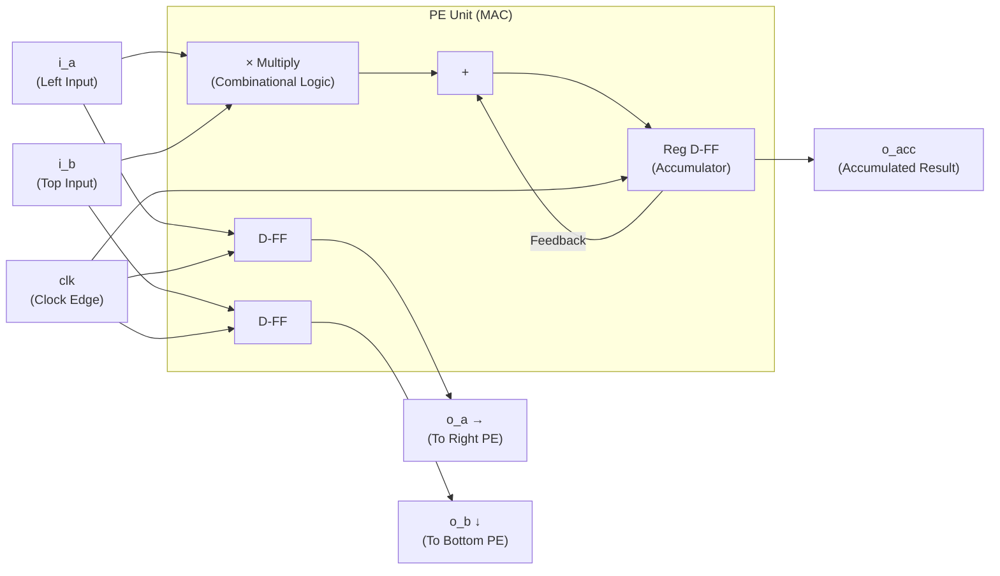
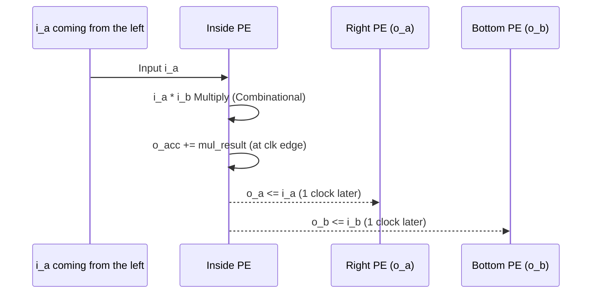

# `pe_unit` — MAC Unit (Minimum Unit of Computation)

## 1. Overview

The PE (Processing Element) is the **Atomic Unit** of the NPU. A single PE has only one job: multiply two input numbers and continuously accumulate the result. This is MAC (Multiply-ACcumulate).

99% of AI computations eventually come down to this `multiplication + accumulation`.

---

## 2. Internal Structure



### Combinational Logic
Multiplication outputs a result **immediately** when the input changes, regardless of the clock.
```systemverilog
assign mul_result = i_a * i_b; // Calculate immediately without clock
```

### Sequential Logic
The Accumulate result is synchronized to the Clock Edge and stored in a register.
```systemverilog
always_ff @(posedge clk or negedge rst_n) begin
    if (!rst_n)
        o_acc <= 16'd0;
    else if (i_valid)
        o_acc <= o_acc + mul_result; // Accumulate every clock
end
```

---

## 3. Data Forwarding Logic

Data flows without stopping. The data used by the current PE is forwarded to the neighboring PE on the **next clock**.



**Latency:** **1 Clock Cycle delay** occurs from input to output.

```systemverilog
// Data Pipeline — Pass data to neighboring PE
o_a <= i_a;  // Pass to Right
o_b <= i_b;  // Pass to Bottom
```

---

## 4. Timing Analysis

```
Clock  ┌─┐ ┌─┐ ┌─┐ ┌─┐ ┌─┐
       ┘ └─┘ └─┘ └─┘ └─┘ └─

i_a    ──┬────X────┬──────
i_b    ──┴────X────┴──────

o_a    ────────►───X────    ← 1 cycle later than i_a
o_b    ────────►───X────    ← 1 cycle later than i_b
```

---

## 5. Pipeline Control via Valid Signal

If the `i_valid` signal is Low, computation stops (Pipeline Stall), and `o_valid` also outputs Low. This valid signal controls the **wavefront timing** across the entire Systolic Array.

```systemverilog
always_ff @(posedge clk or negedge rst_n) begin
    if (!rst_n) begin
        o_acc   <= 16'd0;
        o_valid <= 1'b0;
        o_a     <= 8'd0;
        o_b     <= 8'd0;
    end else if (i_valid) begin
        o_acc   <= o_acc + mul_result;  // Accumulate
        o_valid <= 1'b1;
        o_a     <= i_a;                 // Forward to right
        o_b     <= i_b;                 // Forward to bottom
    end else begin
        o_valid <= 1'b0;                // Stall
    end
end
```

---

## 6. Operation Timing Table (`tb_mac_unit` Verification Result)

| Cycle | i_a | i_b | Multiplication Result | o_acc (Accumulated) |
|--------|-----|-----|-----------|-------------|
| reset  | 0   | 0   | 0         | **0** |
| 1      | 2   | 3   | 6         | **6** |
| 2      | 4   | 5   | 20        | **26** |
| 3      | 10  | 10  | 100       | **126** ✓ |

Testbench Caution: If `i_valid` is not connected, accumulation proceeds constantly.

---

## 7. Port Interface

| Port | Direction | Bit Width | Description |
|------|-----------|-----------|-------------|
| `clk` | in | 1 | Clock (100MHz) |
| `rst_n` | in | 1 | Asynchronous Active-Low Reset |
| `i_valid` | in | 1 | Valid Data Signal |
| `i_a` | in | 8 | Feature Map from the left |
| `i_b` | in | 8 | Weight from the top |
| `o_a` | out | 8 | Forward to right PE |
| `o_b` | out | 8 | Forward to bottom PE |
| `o_valid` | out | 1 | Valid Output Signal |
| `o_acc` | out | 16 | Accumulated MAC Result |