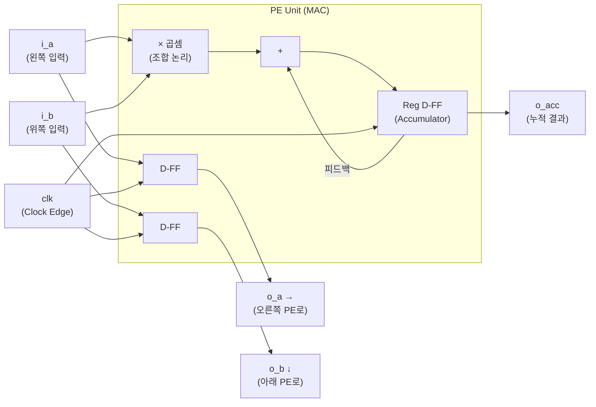
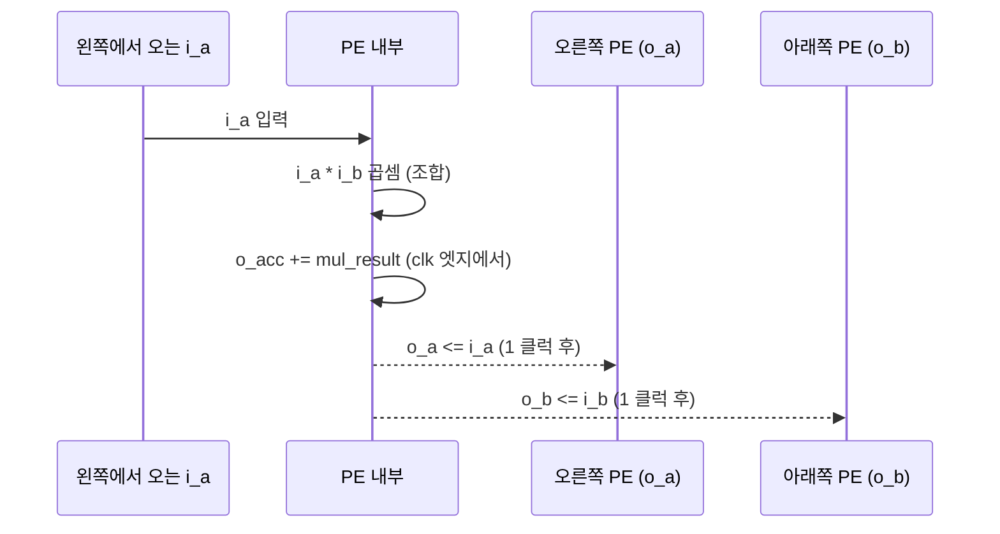

# pe_unit — MAC 연산기 (연산의 최소 단위)

## 1. 개요

PE(Processing Element)는 NPU의 **Atomic Unit**이다. 하나의 PE는 단 하나의 일만 한다: 입력받은 두 수를 곱하고, 그 결과를 계속 더해나가는 것. 이것이 MAC(Multiply-ACcumulate)이다.

TinyNPU-Gemma에서는 **INT8 양자화 모델**을 완벽하게 지원하기 위해, 음수 연산이 가능한 **Signed 8-bit 곱셈**과 오버플로우를 방지하는 **16-bit (최대 32-bit 확장) 누산기** 구조를 채택했다.

---

## 2. 내부 구조



### Combinational Logic (조합 논리)
곱셈은 클럭과 무관하게 입력이 바뀌면 **즉시** 결과가 나온다.
Verilog에서는 기본적으로 숫자를 Unsigned로 취급하기 때문에, 음수 가중치(Weight)와 활성화 값(Activation)을 정확히 곱하기 위해 반드시 `$signed()` 캐스팅을 해야 한다. (이 부분이 초기 디버깅에서 가장 핵심적인 문제였다.)

```systemverilog
// Signed 8-bit x Signed 8-bit = Signed 16-bit
assign mul_result = $signed(i_a) * $signed(i_b);
```

### Sequential Logic (순차 논리)
누산(Accumulate) 결과는 클럭 엣지(Clock Edge)에 동기화되어 레지스터에 저장된다.
```systemverilog
always_ff @(posedge clk or negedge rst_n) begin
    if (!rst_n)
        o_acc <= 16'd0; // Accumulator 리셋
    else if (i_valid)
        o_acc <= o_acc + mul_result; // 클럭마다 부호 있는 연산 누적
end
```

---

## 3. 데이터 포워딩 (Data Forwarding Logic)

데이터는 멈추지 않고 흐른다. 현재 PE가 사용한 데이터는 **다음 클럭에** 이웃 PE로 전달된다.



**Latency:** 입력에서 출력까지 **1 Clock Cycle 지연** 발생.

```systemverilog
// Data Pipeline — 이웃 PE로 데이터 넘기기
o_a <= i_a;  // Pass to Right
o_b <= i_b;  // Pass to Bottom
```

---

## 4. 타이밍 분석

```
Clock  ┌─┐ ┌─┐ ┌─┐ ┌─┐ ┌─┐
       ┘ └─┘ └─┘ └─┘ └─┘ └─

i_a    ──┬────X────┬──────
i_b    ──┴────X────┴──────

o_a    ────────►───X────    ← i_a보다 1 사이클 늦음
o_b    ────────►───X────    ← i_b보다 1 사이클 늦음
```

---

## 5. Valid 신호를 통한 파이프라인 제어

`i_valid` 신호가 Low이면 연산을 멈추고 (Pipeline Stall), `o_valid`도 Low를 내보낸다. 이 valid 신호가 Systolic Array 전체에서 **파도의 타이밍**을 제어한다.

```systemverilog
always_ff @(posedge clk or negedge rst_n) begin
    if (!rst_n) begin
        o_acc   <= 16'd0;
        o_valid <= 1'b0;
        o_a     <= 8'd0;
        o_b     <= 8'd0;
    end else if (i_valid) begin
        o_acc   <= o_acc + mul_result;  // 누산
        o_valid <= 1'b1;
        o_a     <= i_a;                 // 오른쪽으로 포워딩
        o_b     <= i_b;                 // 아래쪽으로 포워딩
    end else begin
        o_valid <= 1'b0;                // Stall
    end
end
```

---

## 6. 음수 곱셈 디버깅 (Debugging History)

설계 초기에는 Verilog의 특성을 간과하고 일반적인 `*` 연산자를 사용했다가, `i_a = -2` (8'hFE), `i_b = 3` (8'h03) 인 경우에 `254 * 3 = 762` 라는 완전히 잘못된 (Unsigned) 결과가 나왔다.

**해결책:**
모든 입력 포트 선언에 `signed` 키워드를 추가하고, 내부 연산시 `$signed()`를 강제 캐스팅함으로써,
`-2 * 3 = -6` 이 정확히 16-bit 2's complement(`16'hFFFA`)로 나오도록 수정하여 하드웨어 검증을 통과했다.

---

## 7. 동작 타이밍 테이블 (tb_mac_unit 검증 결과)

| 사이클 | i_a (Signed 8-bit) | i_b (Signed 8-bit) | 곱셈 결과 (16-bit) | o_acc (누적) |
|--------|---------------------|---------------------|--------------------|-------------|
| reset  | 0                   | 0                   | 0                  | **0** |
| 1      | 2                   | 3                   | 6                  | **6** |
| 2      | -4                  | 5                   | -20                | **-14** |
| 3      | -10                 | -10                 | 100                | **86** ✓ |

---

## 8. 포트 인터페이스

| 포트 | 방향 | 비트 수 | 설명 |
|------|------|---------|------|
| `clk` | in | 1 | 클럭 (100MHz) |
| `rst_n` | in | 1 | 비동기 액티브-로우 리셋 |
| `i_valid` | in | 1 | 유효 데이터 신호 |
| `i_a` | in | 8 (signed) | 왼쪽에서 들어오는 Feature Map (A) |
| `i_b` | in | 8 (signed) | 위쪽에서 내려오는 Weight (B) |
| `o_a` | out | 8 (signed) | 오른쪽 PE로 포워딩 |
| `o_b` | out | 8 (signed) | 아래쪽 PE로 포워딩 |
| `o_valid` | out | 1 | 유효 출력 신호 |
| `o_acc` | out | 16 (signed)| 누적 MAC 결과 |