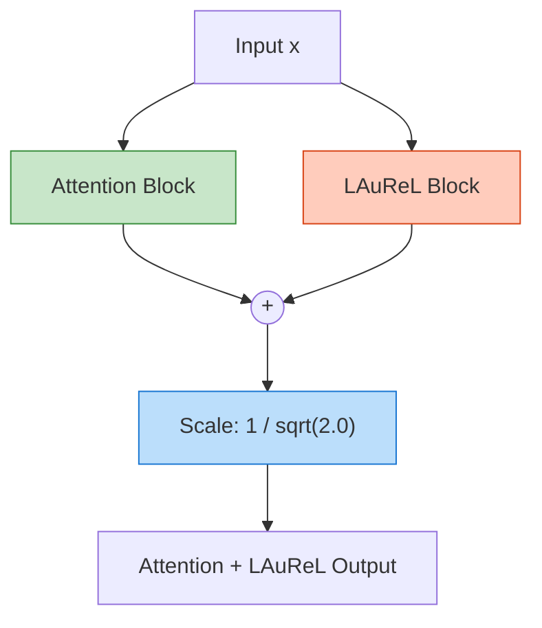
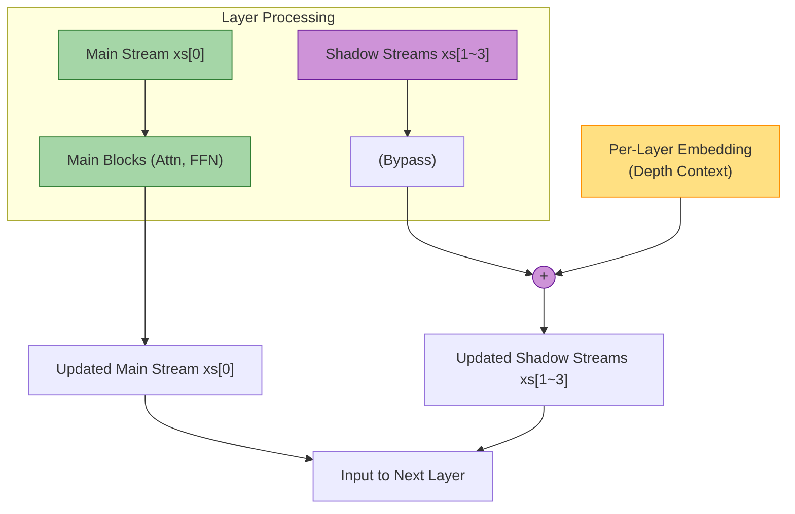

# Calibration Modules: LAuReL and PLE

Gemma 3N employs two distinct calibration modules, LAuReL and PLE, to fine-tune representations and provide layer-aware positional context. This document clarifies their specific injection points and scaling factors, which deviate from simplistic linear additions.

## 1. LAuReL: Parallel Attention Calibration

LAuReL operates as a parallel calibration mechanism alongside the main Attention block. It processes the input concurrently and its output is merged with the Attention output before the first residual connection.

### The Scaling Factor
When the LAuReL output is combined with the main Attention projection output, the combined sum must be scaled down by a factor of $ 1 / \sqrt{2.0} $.

$$
\mathbf{x}_{out} = \frac{\text{Attention}(\mathbf{x}) + \text{LAuReL}(\mathbf{x})}{\sqrt{2.0}}
$$

### Visualization of LAuReL Injection

## 2. PLE (Per-Layer Embedding): Shadow Stream Injection

The Per-Layer Embedding (PLE) injects information about the current layer's depth into the data stream, preventing representation collapse in deep networks.

### The Injection Point Constraint
A critical distinction in Gemma 3N is *where* PLE is injected.

- **Incorrect Assumption:** Injecting PLE into the main data stream (`xs[0]`) at the beginning of the layer.
- **Correct Implementation:** PLE is injected **only** at the very end of the layer, and it is **selectively applied only to the shadow streams (`xs[1]`, `xs[2]`, `xs[3]`)**. The main, pure stream (`xs[0]`) remains completely untouched by the PLE addition.

This design ensures the main computational path remains pure, while the shadow streams, which act as contextual memories, are enriched with depth information.

### Visualization of PLE Injection

By adhering to these specific scaling and routing rules, the LAuReL and PLE modules function as intended, stabilizing the training and inference dynamics of the massive 4-Stream architecture.
