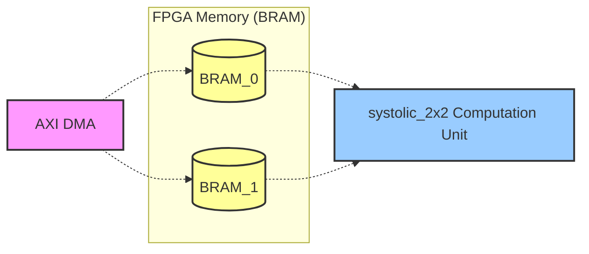
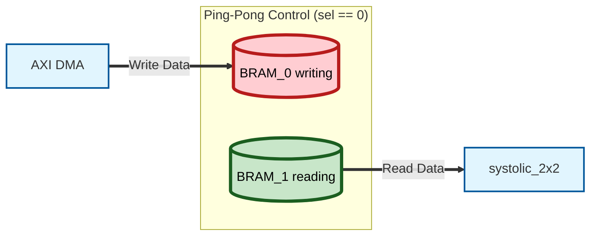
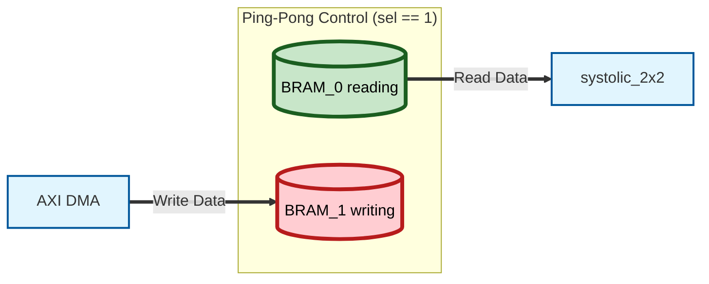

# Ping-Pong BRAM Controller

## Overall Structure (NPU = Mini GPU)
The data flow of the entire system running on the edge board (PYNQ-Z2) is:

> DDR (Main Memory)  BRAM  Systolic Array (Computation Unit)

Translating this to a CUDA environment:

> Host RAM  Shared Memory  CUDA Cores

This design implements the deepest hardware core part where data is fetched from Shared Memory, computed in CUDA Cores, and then stored back.

---

## 1. AXI DMA (Direct Memory Access)

**CUDA Analogy:** `cudaMemcpy(d_A, h_A, size, cudaMemcpyHostToDevice)`

If the CPU (ARM Core) moves data one by one itself, it is too slow.
Therefore, the DMA is a hardware block that rapidly pushes array data from main memory (DDR) into the NPU automatically once the CPU issues a command.

---

## 2. BRAM (Block RAM)

**CUDA Analogy:** Shared Memory (`__shared__`) or L1 Cache

BRAM is a small, incredibly fast block of SRAM embedded inside the FPGA chip. When the DMA temporarily stores data fetched from DDR here, the `systolic_2x2` uses this data every clock cycle. Two BRAMs form a ping-pong buffer.

---

## 3. Parameter

**C++ Analogy:** `template <int N>` or `#define SIZE 8`

```systemverilog
    parameter DATA_WIDTH = 8,
    parameter ADDR_WIDTH = 8 // 256 depth
```

Parameters are constants that define the hardware's size or specifications before the code is synthesized into a chip. For example, `parameter DATA_WIDTH = 8` tells the compiler to synthesize an 8-bit wire path for this module.

---

## 4. Address (Address Calculation)

**C++ Analogy:** Array index `array[index]`

Address is a number specifying which memory slot to read/write. In software, this is accessed via pointers or indices. In hardware, applying an electrical signal like `00000001` to an 8-bit `addr` wire opens the door to memory index 1.

---

## 5. MUX (Multiplexer)

**C++ Analogy:** `if-else` statements, ternary operator `? :`, or pointer switching

```systemverilog
    // BRAM 0 Control
    assign we_0   = (ping_pong_sel == 1'b0) ? dma_we   : 1'b0;       // Disable write when NPU is using it
    assign addr_0 = (ping_pong_sel == 1'b0) ? dma_addr : sys_addr;

    // BRAM 1 Control
    assign we_1   = (ping_pong_sel == 1'b1) ? dma_we   : 1'b0;       // Disable write when NPU is using it
    assign addr_1 = (ping_pong_sel == 1'b1) ? dma_addr : sys_addr;

    // Data going out to Systolic Array (Demux)
    assign sys_rdata = (ping_pong_sel == 1'b0) ? rdata_1 : rdata_0;
```

In software, if a condition is false, the code block inside is not executed. However, in hardware, electricity is always flowing through all modules (wires). Therefore, a MUX acts as a physical switch: "If the selection signal is 0, pass the data from wire A; if 1, pass wire B!" The line `assign sys_rdata = (sel == 0) ? rdata_1 : rdata_0;` is exactly this MUX circuit.

---

## 6. How it Works

### Step 1. Create two modules: `BRAM_0` and `BRAM_1`



### Step 2. Introduce a 1-bit switch (pointer) named `ping_pong_sel`.

### Step 3. When `ping_pong_sel == 0`:
The AXI DMA (external memory) actively writes the next data to `BRAM_0` (Write), while simultaneously, our `systolic_2x2` reads already prepared data from `BRAM_1` (Read) and performs computations.

**Scenario 1: `ping_pong_sel == 0`**
- Switch state: Input to the top (0), Output from the bottom (1)
- **DMA**: Diligently fills `BRAM_0` with data (Write).
- **Systolic**: Fetches data from the already filled `BRAM_1` for computation (Read).



**Switching: After both tasks are complete**
If the DMA finishes writing and the Systolic array finishes computing, the `ping_pong_sel` is toggled: `ping_pong_sel = ~ping_pong_sel` (from 0 to 1).

**Scenario 2: `ping_pong_sel == 1`**
- Switch state: Paths cross over.
- **DMA**: Now fills the empty `BRAM_1` with new data.
- **Systolic**: Fetches data from `BRAM_0` (which the DMA just filled in Scenario 1) for computation.



### Step 4. When both tasks are done, switch `ping_pong_sel = ~ping_pong_sel;` (0 to 1, or 1 to 0).

```cpp
int buffer_0[256]; // BRAM 0
int buffer_1[256]; // BRAM 1

// Phase 1 (ping_pong_sel = 0)
buffer_0[0] = 10; // 0a
buffer_0[1] = 20; // 14

// Phase 2 (ping_pong_sel = 1)
// NPU safely reads from buffer_0
int read_val = buffer_0[0];

// Simultaneously, DMA writes next data into buffer_1!
buffer_1[0] = 30; // 1e  <-- 30 goes in here!
```

---

## 7. Q&A on Simulation Waveforms

> **Q:** "On the simulation waveform, at the exact moment `dma_addr` and `wdata` assign `00` and `0a` (10) into the ram, it looks like `01` and `14` (20) are being assigned simultaneously on the same clock cycle. Is this a problem?"

**A: The core principle of hardware: "Read the past, Write the future" (Non-blocking)**

All flip-flops (memory, registers) in hardware operate only on the **Rising Edge** (the exact moment the waveform shoots up from 0 to 1). There are two absolute rules here:

1. **Setup Time:** When reading, it fetches the value from 'just before the clock tick' (the past).
2. **Clock-to-Q:** The changed value is reflected 'just after the clock tick' (the future).

**[0.001 seconds before the clock tick]**
- `dma_addr` maintains `00`, and `dma_wdata` maintains `0a` (10).

**[Clock Edge Occurs]**
- **BRAM:** Stores the address (`00`) and data (`0a`) it held a moment ago into `ram[0]`. (10 is stored here).
- **Testbench (DMA):** Prepares the next address `01` and data `14` (20). (The waveform values change to `01` and `14` here).

```cpp
// What happens every clock cycle (Loop)
int old_addr = current_addr;
int old_data = current_data;

// 1. BRAM reads the old value (from a moment ago) and stores it
ram[old_addr] = old_data;

// 2. Testbench updates with new values (Happens simultaneously!)
current_addr = 1;
current_data = 20;
```