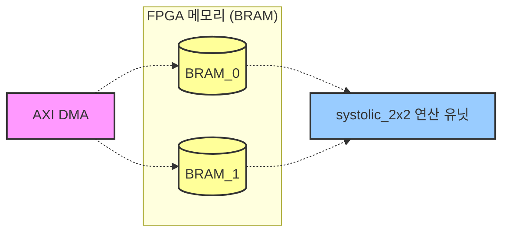
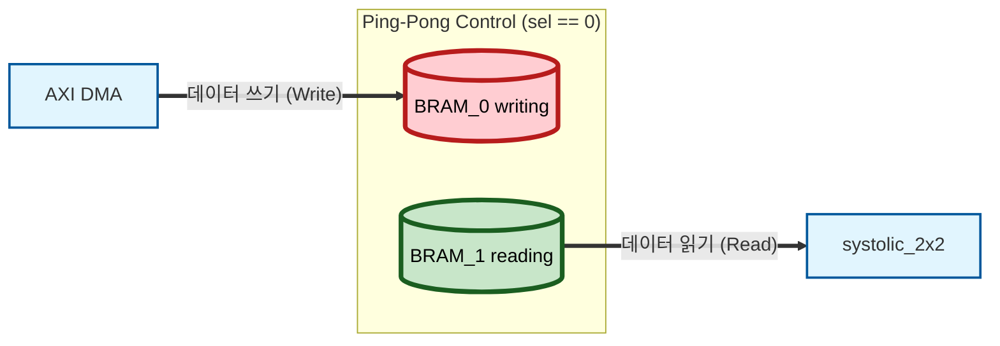
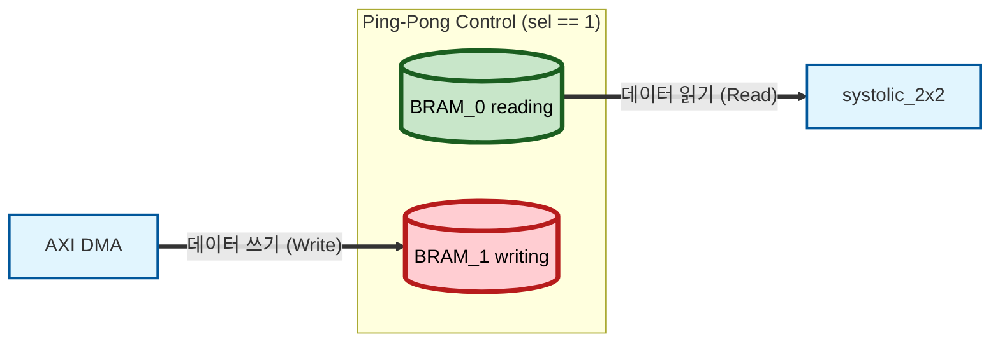

# Ping-Pong BRAM Controller

1. 전체 구조 (NPU = 미니 GPU)
우리가 KV260 보드에서 돌릴 전체 시스템의 데이터 흐름은

> DDR (메인 메모리) ↔ BRAM ↔ Systolic Array (연산기)

## 512-bit Data Packing (데이터 패킹)
메모리 대역폭(Bandwidth)을 극한으로 끌어올리기 위해, BRAM 한 칸의 넓이를 512-bit로 확장했다. 한 번의 읽기(Read) 요청으로 행렬 연산에 필요한 A와 B 데이터를 동시에 가져온다.

* **상위 256-bit:** Weights (가중치 B) 데이터 저장 (8-bit x 32개)
* **하위 256-bit:** Activations (활성화값 A) 데이터 저장 (8-bit x 32개)

이걸 CUDA 환경으로 번역하면

> Host RAM ↔ Shared Memory ↔ CUDA Cores

Shared Memory에서 데이터를 꺼내와서 CUDA Cores에서 연산하고 다시 집어넣는, 하드웨어의 가장 깊숙한(Core) 부분을 설계

# 1.  AXI DMA (Direct Memory Access)

CUDA 비유: cudaMemcpy(d_A, h_A, size, cudaMemcpyHostToDevice)  

 CPU(ARM 코어)가 직접 데이터를 하나하나 옮기면 너무 느림.  
 그래서 CPU 대신 메인메모리(DDR)에 있는 배열 데이터를 NPU 쪽으로 쫙 밀어 넣어라 하고 명령만 내리면, 알아서 데이터를 고속으로 쏴주는 하드웨어 블록

# 2. BRAM (Block RAM)

CUDA 비유: Shared Memory (__shared__) 또는 L1 Cache

FPGA 칩 내부에 콕 박혀있는 작고 엄청나게 빠른 SRAM 덩어리. DMA가 DDR에서 가져온 데이터를 여기에 임시로 저장해두면,  systolic_2x2가 클럭마다 여기서 데이터를 사용함. BRAM 2개가 ping-pong-buffer

# 3. Parameter (파라미터)

C++ 비유: template <int N> 또는 #define SIZE 8

```verilog
    parameter DATA_WIDTH = 8,
    parameter ADDR_WIDTH = 8 // 256 depth
```
코드가 칩으로 구워지기 전(합성 단계)에 하드웨어의 크기나 규격을 결정하는 상수야. 예를 들어 parameter DATA_WIDTH = 8이라고 쓰면, "아, 이 모듈은 8비트짜리 전선(자료형)을 쓰는구나" 하고 컴파일러가 회로를 8가닥으로 맞춰서 그려줌

# 4. Address (주소 연산)

C++ 비유: 배열의 인덱스 array[index]

메모리에서 몇 번째 칸의 데이터를 읽고 쓸지 지정하는 숫자.소프트웨어에선 포인터나 인덱스로 접근하지만, 하드웨어에선 8비트짜리 addr 전선에 00000001 이라는 전기 신호를 주면 메모리의 1번 인덱스 방 문이 열리는 방식.

# 5. MUX (Multiplexer, 멀티플렉서)

C++ 비유: if-else문, 삼항 연산자 ? :, 혹은 포인터 스위칭
```verilog
    // BRAM 0번 제어
    assign we_0   = (ping_pong_sel == 1'b0) ? dma_we   : 1'b0;       // NPU가 쓸 땐 Write 금지
    assign addr_0 = (ping_pong_sel == 1'b0) ? dma_addr : sys_addr;

    // BRAM 1번 제어
    assign we_1   = (ping_pong_sel == 1'b1) ? dma_we   : 1'b0;       // NPU가 쓸 땐 Write 금지
    assign addr_1 = (ping_pong_sel == 1'b1) ? dma_addr : sys_addr;

    // Systolic 쪽으로 나가는 데이터 (Demux)
    assign sys_rdata = (ping_pong_sel == 1'b0) ? rdata_1 : rdata_0;
```
소프트웨어는 if문이 거짓이면 그 안의 코드를 아예 실행 안 하는데. 하지만 하드웨어는 모든 모듈(전선)이 항상 살아서 전기가 흐르고 있음.그래서 MUX라는 스위치를 달아서 "선택 신호가 0이면 A 전선의 데이터를, 1이면 B 전선의 데이터를 통과시켜!"라는 물리적인 길을 터주는 역할. 아까 assign sys_rdata = (sel == 0) ? rdata_1 : rdata_0; 코드가 바로 이 MUX 회로.

# 1. 내부에 BRAM_0과 BRAM_1 모듈 두 개를 생성한다.


# 2.ping_pong_sel이라는 1비트짜리 스위치(포인터)를 둔다.
# 3.ping_pong_sel == 0일 때: AXI DMA (외부 메모리)는 BRAM_0에 다음 연산할 데이터를 열심히 쓰고(Write), 그와 동시에 우리의 systolic_2x2는 BRAM_1에서 이미 준비된 데이터를 읽어와서(Read) 연산을 돌린다.
* 상황 1: ping_pong_sel == 0 일 때
스위치 상태: 위쪽(0번)으로 입력, 아래쪽(1번)에서 출력
DMA: BRAM_0에 열심히 데이터를 채워 넣습니다 (Write).
Systolic: 이미 데이터가 차 있는 BRAM_1에서 데이터를 가져와 연산합니다 (Read).

* 전환 (Switching): 양쪽 작업 완료 후
DMA도 쓰기를 다 했고, Systolic도 연산을 다 마쳤다면?
ping_pong_sel = ~ping_pong_sel (0 → 1)로 바뀝니다.  

* 상황 2: ping_pong_sel == 1 일 때
스위치 상태: 경로가 크로스(교차) 됩니다.
DMA: 이제 비어있는 BRAM_1에 새 데이터를 채웁니다.
Systolic: 아까(상황 1에서) DMA가 꽉 채워둔 BRAM_0의 데이터를 가져와 연산합니다.


```mermaid

```

# 4.양쪽 작업이 다 끝나면 ping_pong_sel = ~ping_pong_sel; 로 스위칭! (0은 1로, 1은 0으로)

```c++
int buffer_0[256]; // BRAM 0
int buffer_1[256]; // BRAM 1

// Phase 1 (ping_pong_sel = 0)
buffer_0[0] = 10; // 0a
buffer_0[1] = 20; // 14

// Phase 2 (ping_pong_sel = 1)
// NPU는 buffer_0에서 데이터를 안전하게 읽고
int read_val = buffer_0[0]; 

// 동시에 DMA는 다음 데이터를 buffer_1에 쓴다!
buffer_1[0] = 30; // 1e  <-- 30은 여기에 들어감!
```

---

## 5. BRAM Latency와 Preload 상태 (Debugging History)

>Q:  "시뮬레이션 웨이브 상으로는 dma_addr과 wdata에 00, 0a(10)이 ram의 값으로 들어가는 순간 동시(클럭상으로 동일)에 dma_addr과 wdata에 01, 14(20)가 할당되는 것처럼 보여 이게 문제 없을까?"  

A: 하드웨어의 핵심: "과거를 읽고, 미래를 쓴다" (<= Non-blocking)

**디버깅 히스토리: 1-Cycle 지연 문제 해결**
초기 설계에서는 FSM(상태머신)이 연산 시작(Run) 상태에 진입함과 동시에 BRAM 주소를 주입하고 데이터를 즉시 읽어오려 했다. 그러나 **BRAM은 동기식(Synchronous) 메모리이므로 주소를 넣은 후 정확히 1 Clock Cycle 뒤에 데이터가 출력(Read Latency)** 된다.
이로 인해 첫 번째 클럭에 쓰레기 값(Garbage data)이 Array로 들어가는 버그가 발생했다.

**해결책:**
FSM에 `PRELOAD` 라는 중간 상태(State)를 삽입했다.
1. `PRELOAD`: 주소 `0`을 BRAM에 주입하고 1클럭 대기한다.
2. `RUN`: 1클럭이 지나면 주소 `0`의 진짜 데이터가 나오기 시작하므로, 이때부터 NPU 연산 Valid 신호를 On 시켜서 연산을 시작한다.
하드웨어의 모든 플립플롭(메모리, 레지스터)은 클럭이 0에서 1로 딱 올라가는 **Rising Edge (파형에서 솟아오르는 순간)** 에만 동작해. 이때 아주 중요한 2가지 절대 규칙이 있어.

* 읽을 때는 '클럭이 뛰기 직전(과거)'의 값을 읽어간다. (Setup Time)

* 값이 변하는 건 '클럭이 뛴 직후(미래)'부터 반영된다. (Clock-to-Q)

[클럭이 뛰기 0.001초 전]

* dma_addr는 00을 유지하고 있고, dma_wdata는 0a (10)을 유지하고 있다.  

[클럭 엣지 발생]

* BRAM : 방금 전까지 가지고 있던 주소(00)랑 데이터(0a) 를 ram[0] 안에 넣음 (여기서 ram[0]에 10이 저장됨)

* 테스트벤치(DMA) : 주소 01이랑 데이터 14 (20)를 저장 (여기서 파형의 값이 01, 14(10진수 20)로 바뀜)  

```c++
// 매 클럭(Loop)마다 일어나는 일
int old_addr = current_addr;
int old_data = current_data;

// 1. BRAM은 옛날(방금 전) 값을 읽어서 저장하고
ram[old_addr] = old_data; 

// 2. 테스트벤치는 새로운 값으로 업데이트함 (동시에 발생!)
current_addr = 1;
current_data = 20;
```