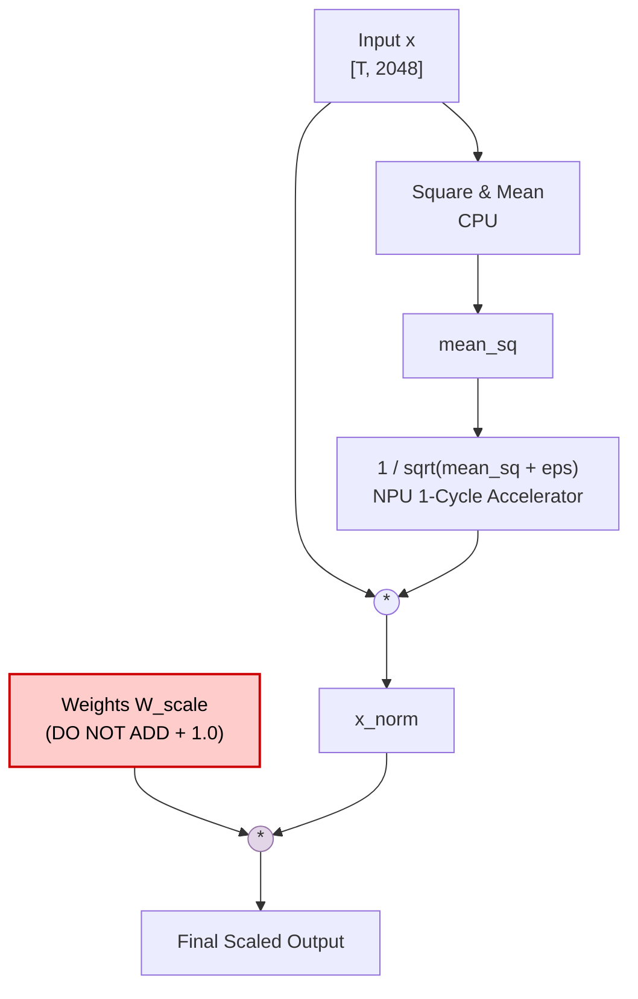
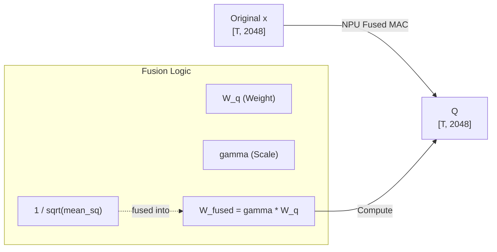

# RMSNorm and Weight Scaling in Gemma 3N

This document explains the revised constraints regarding Root Mean Square Normalization (RMSNorm) and weight handling in the Gemma 3N architecture.

## The `scale_plus_one=False` Constraint

In standard architectures like LLaMA or Gemma 1/2, the weights typically represent the variance from an initialized mean, and standard practice often involves adding a constant `+ 1.0` to the RMSNorm weights to ensure the scaling factor defaults to 1 when the weight parameter is zero.

However, **Gemma 3N strictly utilizes `scale_plus_one=False`**.

### What This Means:
- **Do not add `+ 1.0` to the weights.** The raw weights extracted from the model checkpoint already encode the complete, intended scaling factors.
- **Why?** Adding `+ 1.0` to the raw weights as done previously causes an exponential explosion of intermediate activations, quickly resulting in `NaN` (Not a Number) values during the forward pass. This single change is critical for stability.

## Mathematical Formulation

The standard normalization flow without adding `+ 1.0` is given by:

$$
\mathbf{x}_{norm} = \left( \frac{\mathbf{x}}{\text{RMS}(\mathbf{x})} \right) \cdot \mathbf{W}_{scale}
$$

Where the Root Mean Square (RMS) is:

$$
\text{RMS}(\mathbf{x}) = \sqrt{\frac{1}{d} \sum_{i=1}^{d} x_i^2 + \epsilon}
$$

**Note:** Always ensure that there is proper spacing around inline math symbols, e.g., $ x_i $ instead of $x_i$, to prevent markdown parsing errors.

## Hardware Operation Flow

The NPU computes the RMSNorm by calculating the inverse square root and multiplying it by the scaled weights. The flow is visualized below.

### Fusion Note

In the actual hardware implementation, the NPU combines the multiplication by the inverse square root and the multiplication by the weight matrix (like $ \mathbf{W}_{q} $ , $ \mathbf{W}_{k} $ , $ \mathbf{W}_{v} $ ) and the $ \mathbf{W}_{scale} $ (or $ \gamma $ ) into a single fused operation to save memory bandwidth.

By ensuring the weights are used **exactly as they are**, the model remains mathematically sound and avoids numerical instability.
