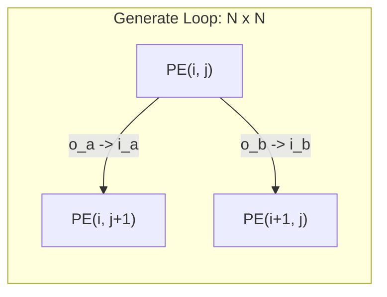

# Systolic Array NxN — Scalable Core Array

## 1. Overview: Evolution from 2x2 to NxN
The hardcoded wire connections of the initial 2x2 prototype become impossible to maintain when scaling up to 4x4 or 8x8 arrays. 
To solve this, we introduced SystemVerilog's `generate for` statements, implementing a **Scalable Architecture** where the entire grid is automatically generated at compile-time simply by changing the `ARRAY_SIZE` parameter.

## 2. 2D Array Routing using Generate Statements
In hardware design, the `generate` block serves a similar purpose to nested loops in C++.

Key Implementation Details
We declare a 2D wire array wire [7:0] a_wires [0:N][0:N] to pre-allocate all connection pathways between the PEs.

External inputs (In_a, In_b) are plugged into the boundaries (a_wires[i][0] and b_wires[0][j]), and the final outputs are extracted from o_acc[i][j].

Advantage: Even when synthesizing a 16x16 array (256 MAC cores), not a single line of the routing code needs to be modified.