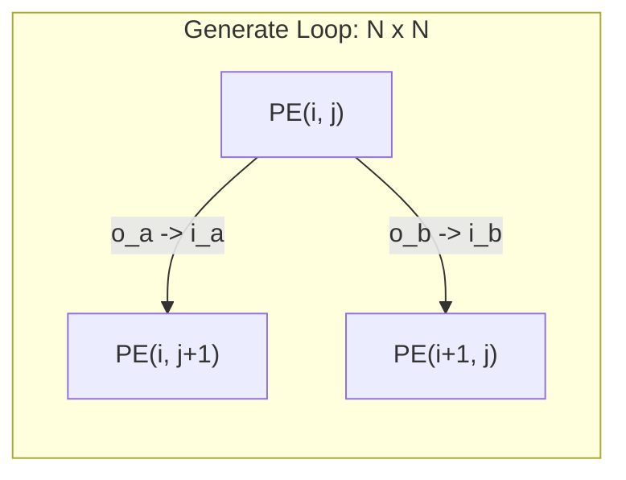

# Systolic Array NxN — Scalable Core Array

## 1. Overview: Maximizing KV260 DSP Resources (32x32)
The hardcoded wire connections of early prototypes become impossible to maintain when scaling up. To solve this, we introduced SystemVerilog's `generate for` statements, implementing a **Scalable Architecture** where the entire grid is automatically generated at compile-time simply by changing the `ARRAY_SIZE` parameter.

**For the TinyNPU-Gemma project on the Kria KV260:**
The KV260 features exactly **1,248 DSP48E2 slices**. A fully parallel 64x64 array would require 4,096 DSPs, which far exceeds the capacity. Therefore, we explicitly targeted `ARRAY_SIZE=32`, utilizing **1,024 DSP slices** to maximize throughput while perfectly fitting the hardware boundaries.

## 2. Bit-Width Strategy: 8-bit to 16/32-bit to 8-bit
As data flows through the 32x32 array, it undergoes rigorous bit-width management to prevent overflow during MAC operations:
1. **Input:** INT8 (Signed 8-bit) activations and weights enter the array.
2. **Accumulation:** The internal MAC units accumulate up to 32 times (across a row). To safely contain the maximum possible sum ($127 \times 127 \times 32$), the `o_acc` output uses **16-bit to 32-bit registers** (depending on precision mode).
3. **Requantization:** Before the data is outputted from the NPU or passed to the activation functions, it is re-scaled and squashed back down to INT8.

## 3. 2D Array Routing using Generate Statements
In hardware design, the `generate` block serves a similar purpose to nested loops in C++.

Key Implementation Details
We declare a 2D wire array wire [7:0] a_wires [0:N][0:N] to pre-allocate all connection pathways between the PEs.

External inputs (In_a, In_b) are plugged into the boundaries (a_wires[i][0] and b_wires[0][j]), and the final outputs are extracted from o_acc[i][j].

Advantage: Even when synthesizing the massive 32x32 array (1,024 MAC cores) for the KV260, not a single line of the routing code needs to be modified.