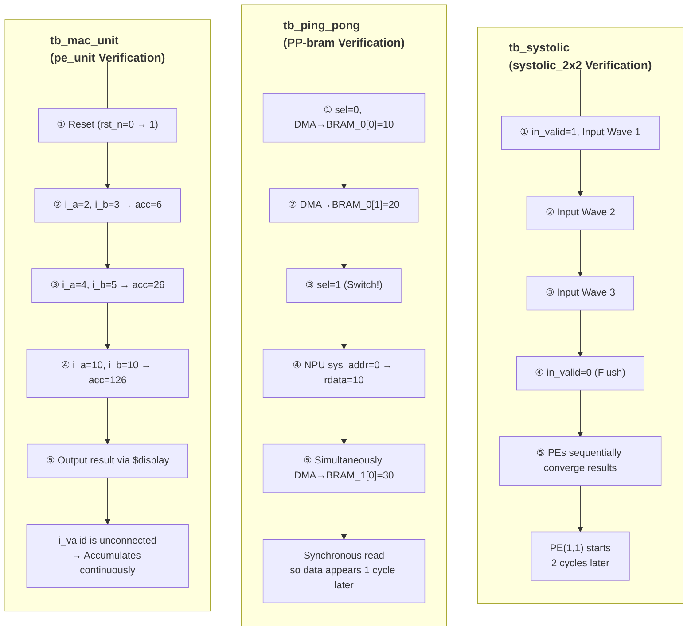
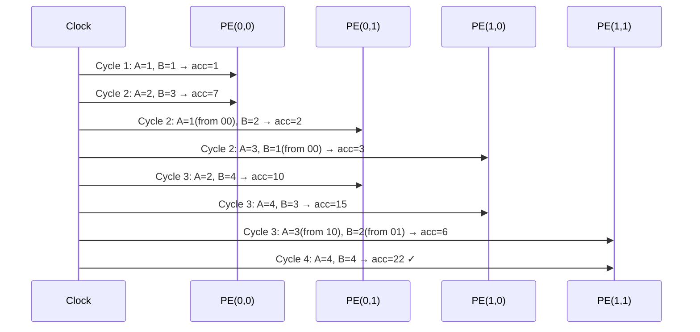

# Testbench Simulation Flow

Three testbenches verify each respective module.

---

## Overall Verification Structure



---

## 1. `tb_mac_unit` — `pe_unit` Standalone Verification

Verifies a single PE in isolation. Inputs are provided every clock, and it checks whether the accumulated result is correct.

```
Scenario:
  rst_n = 0 → 1  (Release Reset)
  Cycle 1: i_a=2, i_b=3  → acc = 0 + 6  = 6
  Cycle 2: i_a=4, i_b=5  → acc = 6 + 20 = 26
  Cycle 3: i_a=10, i_b=10 → acc = 26 + 100 = 126 ✓
```

**Known Issue:** The `i_valid` port is unconnected in `tb_mac_unit.sv`, meaning it operates in an always-valid state. It does not test the valid control differently from the actual systolic array.

---

## 2. `tb_ping_pong` — `ping_pong_bram` Double Buffer Verification

The core of the ping-pong buffer: verify that DMA writes and NPU reads occur **simultaneously**.

```
Phase 1 (sel=0):
  DMA → BRAM_0[0] = 10
  DMA → BRAM_0[1] = 20

Phase 2 (sel=1, Switch!):
  NPU  → sys_addr=0 → (1 cycle later) rdata = 10  ← Read from BRAM_0
  DMA  → BRAM_1[0] = 30                           ← Write to BRAM_1 (Simultaneous!)
  NPU  → sys_addr=1 → (1 cycle later) rdata = 20
```

**Synchronous Read Caution:** Because `simple_bram` is synchronous, data is output on the **next clock** after the address is inputted.

---

## 3. `tb_systolic` — `systolic_2x2` Matrix Multiplication Verification

Verifies the 2x2 matrix multiplication result by flowing waves over 4 cycles.

| Cycle | in_a_0 | in_a_1 | in_b_0 | in_b_1 | Event |
|--------|--------|--------|--------|--------|--------|
| 1 | 1 | 0 | 1 | 0 | PE(0,0) starts first computation |
| 2 | 2 | 3 | 3 | 2 | Wave spreads: PE(0,0), (0,1), (1,0) activate |
| 3 | 0 | 4 | 0 | 4 | Full activation: PE(1,1) first computation |
| 4 | 0 | 0 | 0 | 0 | valid=0 (flush): PE(1,1) final computation |

**Valid Propagation Delay:** Computations at PE(0,1) and PE(1,0) are delayed by **1 cycle** compared to PE(0,0). Computations at PE(1,1) start **2 cycles** later.



---

## 4. Verification Environment

- **EDA Tool:** Xilinx Vivado 2025.2
- **Target:** xc7z020clg400-1 (PYNQ-Z2)
- **Simulator:** XSim (Built-in Vivado) + Verilator (High-speed C++ based)

```bash
# Fast simulation with Verilator
verilator --cc --exe --build tb_systolic.sv systolic_2x2.sv pe_unit.sv
./obj_dir/Vsystolic_2x2
```