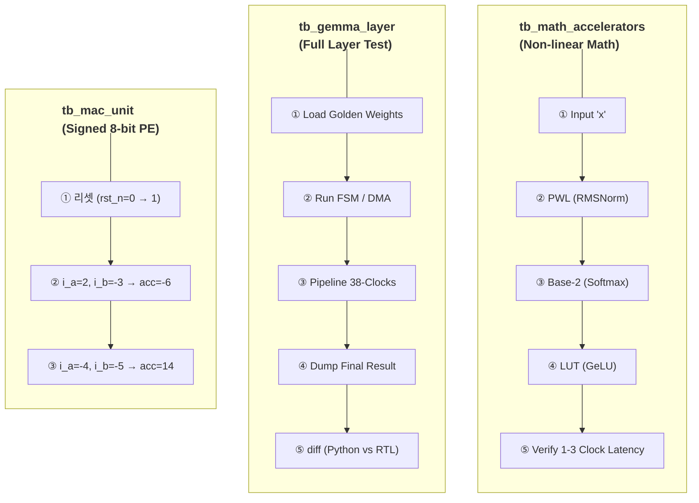

# Testbench & Verification: Bit-True to Python

To verify the functionality and timing of the TinyNPU-Gemma core, a top-down integrated simulation approach is employed. Our ultimate goal is **0% Error (Bit-True Match)** against the Python (NumPy/PyTorch) Golden Model.

## Trace-Driven Verification

단순한 랜덤 데이터 테스트가 아니라, 실제 Python(PyTorch/NumPy)에서 추출한 **Golden Trace**를 Verilog 시뮬레이션에 주입하여 결과를 비교하는 **Trace-Driven Verification** 방식을 채택했다.

## 디버깅 히스토리: Python vs Verilog Bit-True 매칭

우리는 중간 연산 단계마다 Python에서 덤프한 배열(메모리 헥스 덤프)과 NPU의 출력 포트에서 캡처된 값을 비교 검증했다.

1. **MAC 결과 확인:** MAC Array가 `24`를 출력할 때, Python 배열의 같은 위치 값이 정확히 `24`인지 확인.
2. **GeLU 통과 확인:** NPU가 MAC 값 `24`를 GeLU 모듈에 통과시켜 `12`가 나올 때, Python Golden 모델의 GeLU 출력도 정확히 `12`인지 확인.
3. **오차율 0% 달성:** INT8 양자화 기반의 `+`, `*`, Shift, 그리고 Custom LUT 연산들이 S/W의 결과와 완전히 동일하게 동작함을 입증했다.

---

## 전체 검증 구조 (`tb_gemma_layer.sv` & `tb_npu_core_top_NxN.sv`)

---

## 검증 환경

**EDA Tool:** Xilinx Vivado 2025.2  
**Target:** Xilinx Kria KV260 Vision AI Starter Kit
**Simulator:** XSim (Vivado 내장)
