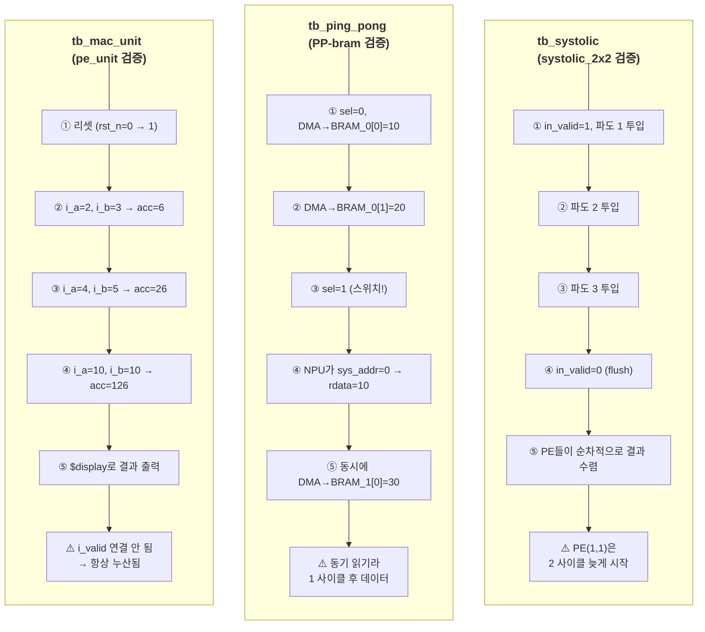
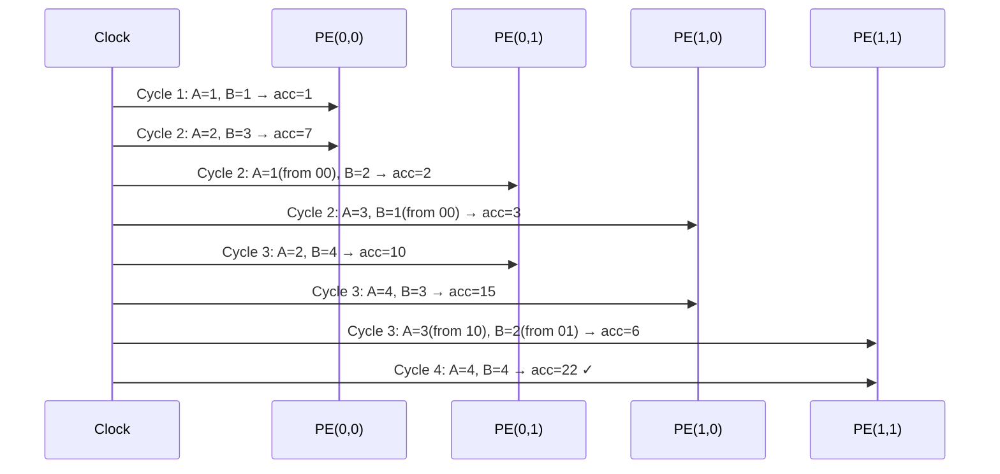

# 테스트벤치 시뮬레이션 흐름

세 개의 testbench가 각 모듈을 검증한다.

---

## 전체 검증 구조



---

## 1. tb_mac_unit — pe_unit 단독 검증

PE 하나를 단독으로 검증한다. 매 클럭 입력을 넣고 누적 결과가 올바른지 확인.

```
시나리오:
  rst_n = 0 → 1  (리셋 해제)
  Cycle 1: i_a=2, i_b=3  → acc = 0 + 6  = 6
  Cycle 2: i_a=4, i_b=5  → acc = 6 + 20 = 26
  Cycle 3: i_a=10, i_b=10 → acc = 26 + 100 = 126 ✓
```

**알려진 이슈:** `tb_mac_unit.sv`에서 `i_valid` 포트가 연결되지 않아 항상 valid 상태로 동작한다. 실제 systolic 배열과 달리 valid 제어를 테스트하지 못한다.

---

## 2. tb_ping_pong — ping_pong_bram 더블버퍼 검증

핑퐁 버퍼의 핵심: DMA 쓰기와 NPU 읽기가 **동시에** 일어나는지 확인.

```
Phase 1 (sel=0):
  DMA → BRAM_0[0] = 10
  DMA → BRAM_0[1] = 20

Phase 2 (sel=1, 스위치!):
  NPU  → sys_addr=0 → (1 사이클 후) rdata = 10  ← BRAM_0에서 읽기
  DMA  → BRAM_1[0] = 30                          ← BRAM_1에 쓰기 (동시!)
  NPU  → sys_addr=1 → (1 사이클 후) rdata = 20
```

**동기식 읽기 주의:** `simple_bram`은 동기식이므로 주소 입력 후 **다음 클럭**에 데이터가 나온다.

---

## 3. tb_systolic — systolic_2x2 행렬 연산 검증

4사이클 파도를 흘려보내며 2×2 행렬 곱 결과를 검증한다.

| 사이클 | in_a_0 | in_a_1 | in_b_0 | in_b_1 | 이벤트 |
|--------|--------|--------|--------|--------|--------|
| 1 | 1 | 0 | 1 | 0 | PE(0,0) 첫 연산 시작 |
| 2 | 2 | 3 | 3 | 2 | 파도 확산: PE(0,0), (0,1), (1,0) 가동 |
| 3 | 0 | 4 | 0 | 4 | 전체 가동: PE(1,1) 첫 연산 |
| 4 | 0 | 0 | 0 | 0 | valid=0 (flush): PE(1,1) 마지막 연산 |

**valid 전파 지연:** PE(0,0) → PE(0,1), PE(1,0)까지는 **1 사이클** 늦고, PE(1,1)은 **2 사이클** 늦게 계산을 시작한다.



---

## 4. 검증 환경

**EDA Tool:** Xilinx Vivado 2025.2  
**Target:** xc7z020clg400-1 (PYNQ-Z2)  
**Simulator:** XSim (Vivado 내장) + Verilator (고속 C++ 기반)

```bash
# Verilator로 빠른 시뮬레이션
verilator --cc --exe --build tb_systolic.sv systolic_2x2.sv pe_unit.sv
./obj_dir/Vsystolic_2x2
```