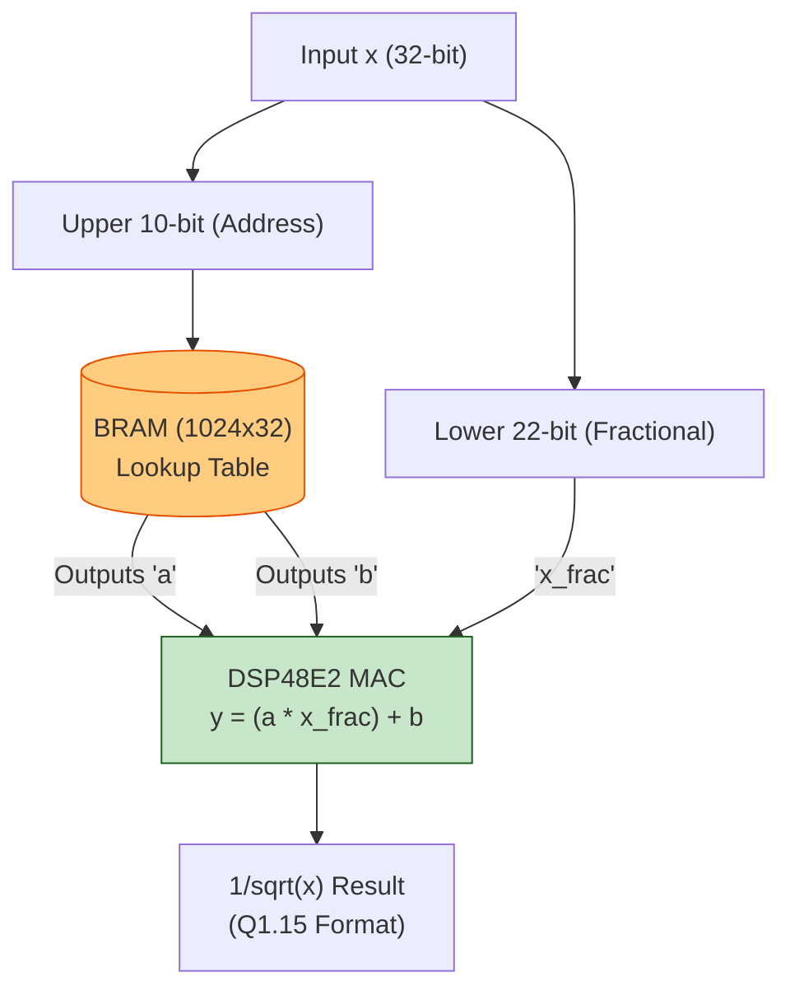
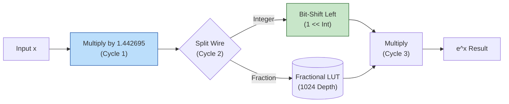
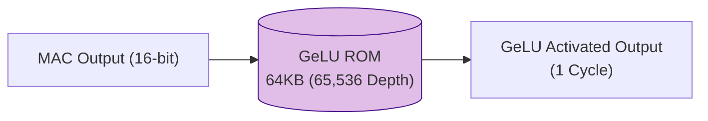

# The Math Accelerators (RMSNorm, Softmax, GeLU)

To achieve a full hardware bypass of the CPU and process the Gemma 3-4B-IT LLM end-to-end within the KV260, we designed highly optimized, custom Math Accelerators. These modules compute complex non-linear mathematical formulas in just 1 to 3 clock cycles.

---

## 1. 1-Clock RMSNorm Accelerator (`rmsnorm_inv_sqrt.sv`)

**Target Operation:** Inverse Square Root ($1/\sqrt{x}$)
**Latency:** 1 Clock Cycle
**Method:** Piecewise Linear Approximation (PWL)

In software, dividing by a square root takes dozens of cycles. We accelerated this by approximating the non-linear curve with 1024 tiny linear segments ($y = ax + b$).

### Hardware Architecture
1. **BRAM LUT (1024 Depth):** The upper 10 bits of the input `x` act as a memory address. The BRAM outputs the pre-calculated `Slope (a)` and `Intercept (b)` for that specific segment.
2. **DSP Computation:** The lower 22 bits of `x` act as the relative distance inside the segment. A single DSP48E2 slice calculates `(a * x_lower) + b` within 1 clock cycle.

---

## 2. 3-Clock Softmax Accelerator (`softmax_exp_unit.sv`)

**Target Operation:** Natural Exponential ($e^x$)
**Latency:** 3 Clock Cycles
**Method:** Base-2 Conversion ($e^x = 2^{x \cdot \log_2 e}$)

Calculating $e^x$ using Taylor series requires floating-point division and many loops. We completely bypassed this by switching bases.

### Hardware Architecture
1. **Multiplication (Cycle 1):** Multiply the input by the constant $\log_2 e \approx 1.442695$.
2. **Split (Cycle 2):** Hardware splits the result into an `Integer` part and a `Fractional` part automatically by tapping different wires.
3. **Shift & LUT (Cycle 3):**
   - **Integer Part:** $2^{\text{int}}$ is calculated simply by shifting the bits to the left (`1 << int_part`). This costs **zero hardware logic**.
   - **Fractional Part:** $2^{\text{frac}}$ is fetched from a tiny 1024-segment LUT.
4. **Final Result:** Multiply the shifted integer result by the fractional LUT output.

---

## 3. 1-Clock GeLU Accelerator (`gelu_lut.sv`)

**Target Operation:** Gaussian Error Linear Unit ($0.5x(1 + \text{tanh}(\dots))$)
**Latency:** 1 Clock Cycle
**Method:** Full-ROM Lookup Table

GeLU requires calculating complex trigonometric functions. Since we operate on 16-bit intermediate values, the total number of possible inputs is only $2^{16} = 65,536$.

### Hardware Architecture
We mapped all 65,536 possible answers into a 64KB Block RAM (ROM). When a 16-bit MAC result comes in, it immediately serves as the address, outputting the GeLU result on the very next clock cycle.

