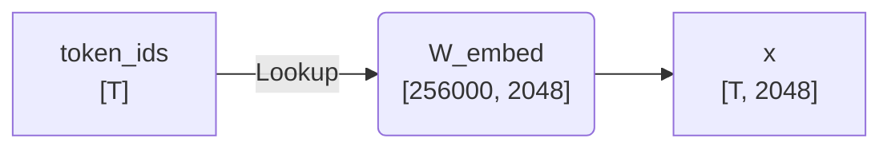
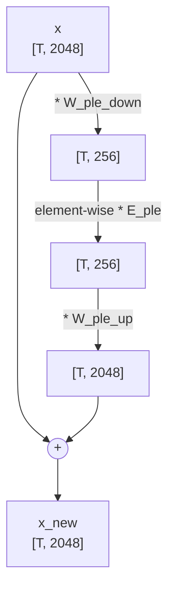
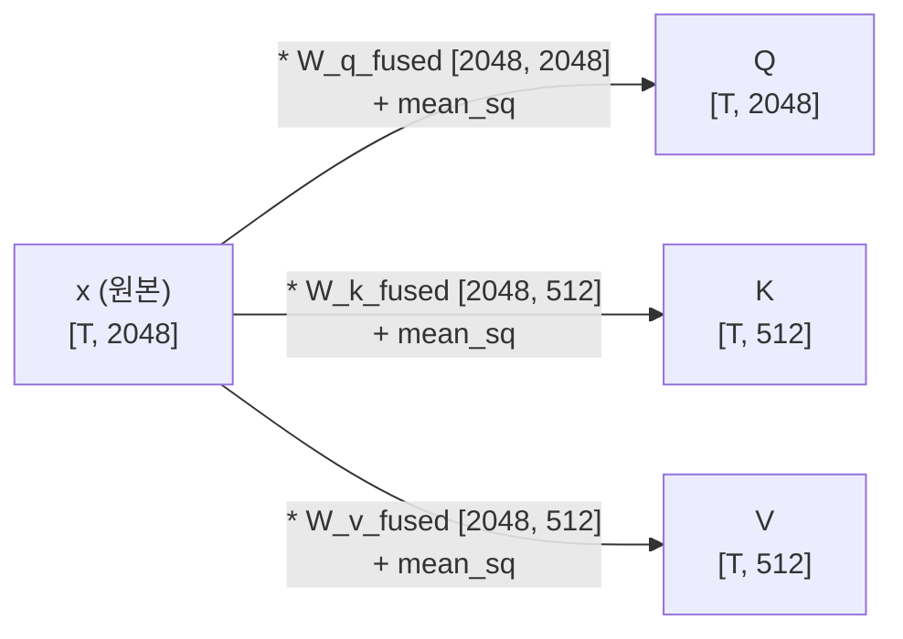
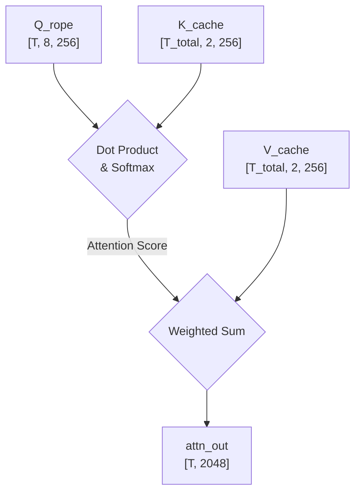
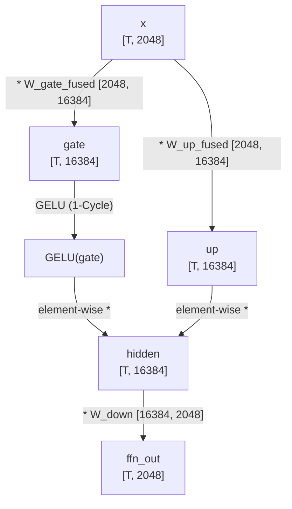
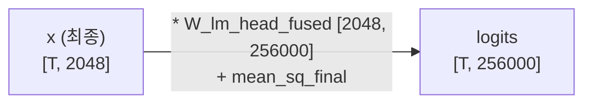

# Gemma 3N E4B Forward Pass: 하드웨어(CPU/NPU) 분배 및 코드 매핑

이 문서는 Gemma 3 4B 모델에 "안녕하세요" 라는 텍스트가 입력되어 처리되는 전체 Forward Pass 과정을 다룹니다. 상세한 개념 설명, 데이터 흐름(Mermaid), 그리고 NPU 가속 환경에서 Weight Fusion(가중치 퓨전) 기법을 적용하여 최적화한 파이썬 제어 코드를 모두 통합했습니다.

## Phase 1: 입력 및 임베딩 처리

### 1. 토큰화 (Tokenize) 및 가중치 로드 : CPU

**동작**: AI는 한글을 직접 못 읽으므로, 입력 텍스트 "안녕하세요"를 자기가 아는 정수 ID 번호표로 바꿉니다. ("안녕" -> 4512번, "하세요" -> 8931번 등). 단순한 사전 검색 작업이라 CPU가 처리합니다.

💡 **무엇을 & 왜 하는 건가요?**

**무엇을**: 사람이 쓰는 자연어(글자)를 컴퓨터가 처리할 수 있는 고유한 숫자(ID) 로 치환하는 작업이야.

**왜**: 컴퓨터 연산기(ALU/MAC)는 숫자만 계산할 수 있으니까! 텍스트 그대로는 행렬 곱셈을 할 수가 없어서, 모델이 미리 학습해둔 25만 개의 단어 사전과 대조해서 고유 번호를 부여하는 필수 전처리 과정이야.

**Shape**: token_ids: [T] (1차원 배열, 여기서 $T$ 는 토큰 수)

```python
# 1. 퓨전된 가중치 로드
W_embed, W_lm_head_fused, weights = safeTensor.load_local_weights()

K_cache = [[] for _ in range(35)]
V_cache = [[] for _ in range(35)]

prompt = "안녕 하세요"
input_tokens = CPU_CORE.tokenize(prompt)
```

### 2. 임베딩 (Embedding) : CPU

**동작**: 숫자만 있으면 의미를 모르니, 해당 번호를 거대한 사전에서 찾아 긴 숫자 배열(벡터) 로 바꿉니다. 게임 캐릭터 스탯창을 만드는 것과 같습니다.

💡 **무엇을 & 왜 하는 건가요?**

**무엇을**: 단순한 정수 ID(예: 4512)를 2048개의 소수점으로 이루어진 연속적인 수치(벡터) 로 변환해.

**왜**: 4512번("안녕")과 4513번("사과")은 번호는 가깝지만 뜻은 완전 다르잖아? 단순 숫자로는 단어 간의 '의미적 거리'를 계산할 수 없어. 그래서 단어의 뜻, 문법적 성질 등을 2048개의 차원에 흩뿌려서 수학적인 공간(Vector Space) 에 배치하는 거야. 그래야 AI가 "아, 이 단어들은 의미가 비슷하구나!" 하고 내적(Dot Product) 연산으로 유사도를 계산할 수 있거든.

**Shape**: x: [T, 2048]



```python
x = CPU_CORE.embedding(input_tokens[-1], W_embed)
```

**수학식**:
$$
\mathbf{x} = W_{embed}[\text{token\_ids}]
$$

## Phase 2: Transformer Block (35번 반복 시작)

매 레이어마다 아래의 파이프라인이 반복됩니다.

```python
for layer in range(35):
    # [A] Attention Block 시작
```

### 3. PLE (Per-Layer Embedding) 주입 : CPU

**동작**: Gemma 3의 고유 특징으로, 각 레이어마다 자기가 몇 번째 층인지 위치 정보를 입력 벡터에 살짝 섞어줍니다.

💡 **무엇을 & 왜 하는 건가요?**

**무엇을**: 현재 데이터가 35개의 층 중 몇 번째 층(Layer) 을 통과하고 있는지 레이어의 고유 ID 값을 원본 데이터에 주입해.

**왜**: 층이 깊어질수록 데이터가 이리저리 섞이면서 자기가 어디쯤 계산되고 있는지 길을 잃어버리는 현상(Representation Collapse)이 생길 수 있어. PLE를 섞어주면 모델이 "아, 난 지금 15층을 지나고 있으니 중간 단계의 추론을 해야겠다"라고 스스로 인지해서 성능이 훨씬 좋아져.

**Shape**: x: [T, 2048]



```python
    x = CPU_CORE.inject_ple(x, ple_down, ple_emb, ple_up)
```

**수학식**:
$$
\mathbf{x} = \mathbf{x} + ( ( \mathbf{x} \cdot W_{ple\_down} ) \odot E_{ple} ) \cdot W_{ple\_up}
$$

### 4 & 5. Pre-Attention RMSNorm & Q,K,V 행렬 곱 퓨전 : NPU

**동작 (RMSNorm)**: 오디션 심사처럼, 성량이 너무 큰 가수(값 100)와 모기 소리 가수(값 1)의 평균 에너지를 구해 볼륨을 평준화합니다. AI가 데이터 크기에 휘둘리지 않게 꾹꾹 눌러 담아줍니다.

**동작 (Q,K,V & Fusion)**: 입력 데이터를 질문(Q), 힌트(K), 내용(V)으로 분신술을 씁니다. 여기서 Weight Fusion 이 빛을 발합니다. 원본 $ x $의 제곱 평균(mean_sq)만 CPU에서 구해주면, NPU가 inv_sqrt를 곱하고 미리 감마($ \gamma $ )값이 퓨전된 가중치와 연산하여 정규화와 거대한 행렬 곱을 한 번에 끝냅니다.

💡 **무엇을 & 왜 하는 건가요?**

**무엇을**: 숫자의 크기를 일정하게 맞춘(Norm) 뒤, 데이터를 Q(찾고자 하는 것), K(내가 가진 특징), V(실제 정보) 3가지 역할로 나눠치기 해.

**왜 (Norm)**: 행렬 곱셈을 수십 번 반복하면 숫자가 무한대로 커지거나(폭발) 0으로 수렴해버려. 그래서 연산 전에 항상 값의 덩치를 표준 사이즈로 다듬어줘야 AI가 안정적으로 계산할 수 있어.

**왜 (Q,K,V)**: 이게 어텐션(Attention)의 핵심이야. "안녕하세요"라는 단어가 문맥을 파악하려면 '누구'랑 연결될지 알아야 하잖아? 그래서 Q(질문)를 던져서 다른 단어들의 K(힌트)와 매칭시켜보고, 궁합이 맞으면 그 단어의 V(내용)를 흡수하려고 3개로 복제하는 거야.

**왜 (퓨전)**: NPU 메모리 대역폭을 아끼기 위해서! Norm하고 메모리 썼다가, 다시 읽어서 QKV 곱하면 너무 느려지니까 하드웨어 단에서 한 방에 처리해버리는 최적화 꼼수지.

**Shape**: Q [T, 2048], K [T, 512], V [T, 512]



```python
    mean_sq = np.mean(x**2)
    
    # 🔥 원본 x를 그대로 넣어도 NPU가 inv_sqrt를 곱하고 Fused Weight랑 연산해서 완벽한 Norm 결과가 나옴!
    Q = NPU_CORE.npu_matmul(x, weights["W_q_fused"][layer], mean_sq)
    K = NPU_CORE.npu_matmul(x, weights["W_k_fused"][layer], mean_sq)
    V = NPU_CORE.npu_matmul(x, weights["W_v_fused"][layer], mean_sq)
```

**수학식 (퓨전 원리)**:
$$
\mathbf{Q} = \left( \frac{\mathbf{x}}{\text{RMS}(\mathbf{x})} \right) \cdot ( \gamma_i \odot W_q )
$$

### 6. QK-Norm : CPU

**동작**: Gemma 3의 특징으로, 거대한 행렬 곱셈 후 튀어버릴 수 있는 Q와 K의 크기를 한 번 더 정규화하여 값이 우주로 발산하는 걸 막습니다.

💡 **무엇을 & 왜 하는 건가요?**

**무엇을**: 막 만들어진 Q와 K 벡터를 다시 한번 크기 조절(Norm) 해줘.

**왜**: 나중에 Q와 K를 내적(곱하기)해서 연관성 점수를 매길 건데, 특정 벡터 값이 혼자 너무 비정상적으로 크면 점수판을 독식해버려. 다른 단어들은 다 무시당하는 거지. 그걸 막기 위해 미리 스케일을 눌러주는 안전장치야.

```python
    Q_norm, K_norm = CPU_CORE.cpu_qk_norm(Q, K, weights["gamma_q"][layer], weights["gamma_k"][layer])
```

### 7. RoPE (회전 위치 임베딩) : CPU

**동작**: 단어의 순서표를 달아줍니다. 1번 단어는 10도, 2번 단어는 20도 식으로 수학적 회전(Rotation Matrix)을 가합니다. 절대적인 번호가 아니라 각도 차이(상대적 거리)를 통해 문맥을 파악하게 하는 천재적인 기법입니다.

💡 **무엇을 & 왜 하는 건가요?**

**무엇을**: Q와 K 벡터의 값을 수학적으로 특정 각도( $\theta$ )만큼 뺑글뺑글 회전 시켜.

**왜**: AI는 텍스트를 순서대로 읽는 게 아니라 한 번에 통째로 봐. 그래서 "너가 나를" 이랑 "내가 너를" 을 구분 못 해. 이 순서(위치) 정보를 알려줘야 하는데, 단순히 '1번, 2번' 숫자를 더하는 것보다 각도를 돌려버리면 단어 사이의 거리(상대적 위치) 를 모델이 기가 막히게 잘 인식하거든. 가까운 단어는 각도 차이가 적고, 먼 단어는 각도 차이가 크게 나서 연관성 계산에 딱 맞아.

```python
    Q_rope, K_rope = CPU_CORE.cpu_rope(Q_norm, pos=10, theta_base=10000)
```

### 8. KV 캐시 (KV Cache) 업데이트 : CPU

**동작**: 멍청하게 매번 처음부터 계산하지 않기 위해, 이미 계산한 K(힌트)와 V(내용)를 메모리에 저장해둡니다. 문장이 길어질수록 메모리가 터져나가는(Memory Bound) 주범입니다.

💡 **무엇을 & 왜 하는 건가요?**

**무엇을**: 지금 계산한 K와 V 값을 외부 메모리(DRAM 등)의 창고에 차곡차곡 쌓아둬.

**왜**: AI가 답변을 한 글자씩 뱉을 때마다(Autoregressive), 과거에 썼던 단어들의 K, V를 처음부터 다시 계산하면 연산량이 기하급수적으로 폭발해. 이미 계산해 둔 건 메모리에 킵해두고 새로 들어온 단어 하나만 계산해서 기존 캐시랑 비교하면 속도가 엄청나게 빨라지니까 무조건 써야 하는 기술이야.

```python
    CPU_CORE.cpu_update_kv_cache(K_rope, V, layer, K_cache, V_cache)
```

### 9. GQA (Sliding Window Attention) : CPU

**동작**: K와 V가 너무 많아 메모리가 터지는 걸 막기 위해 도입된 GQA입니다. 8명의 질문자(Q)가 2개의 힌트(K)와 내용(V)을 공유해서 씁니다. 현재 질문(Q)이 캐시된 K를 훑어보고 연관성 점수를 매긴 뒤, 그 점수대로 V를 섞어 문맥을 이해합니다.

💡 **무엇을 & 왜 하는 건가요?**

**무엇을**: 핵심 중의 핵심 연산! Q(현재 단어)가 저장된 모든 K(과거 단어들)와 내적(Dot Product)을 해서 "너랑 나랑 얼마나 친해?" 하고 Score(점수) 를 매겨. 그리고 그 점수 비율만큼 상대방의 V(실제 의미)를 쫙 빨아들여서 섞어.

**왜**: 이 과정을 거쳐야 비로소 "하세요" 라는 단어가 단순한 글자를 넘어서 "아, 내 앞의 '안녕'이랑 엮여서 쓰이는 인사말 문맥이구나!" 하고 문맥(Context)을 이해하게 되거든.

**왜 (GQA)**: Q 개수만큼 K, V를 다 만들면 캐시 메모리가 모자라서 터져. 그래서 K, V 개수를 대폭 줄여서 여러 Q가 하나의 K, V를 나눠 쓰도록 타협한 구조야. (성능 저하는 거의 없고 속도는 날아감!)

**Shape**: attn_out: [T, 2048]



```python
    attn_out = CPU_CORE.cpu_gqa(Q_rope, K_cache[layer], V_cache[layer])
```

### 10 & 11. Output Projection & 1차 잔차 연결 : NPU / CPU

**동작**: 여러 헤드로 나뉘어 각자 분석했던 정보들을 하나로 뭉쳐줍니다. 그리고 머리를 너무 굴리다 원본 뜻을 까먹지 않도록 3단계에서 들어왔던 원본 $x$ 를 그대로 더해줍니다(지름길).

💡 **무엇을 & 왜 하는 건가요?**

**무엇을**: 헤드(Head)별로 쪼개서 각기 다른 관점으로 파악한 문맥 덩어리들을 $W_o$ 행렬 곱셈 으로 하나로 이쁘게 버무려주고, 맨 처음 들어왔던 입력 $x$ 를 한 번 더해줘.

**왜 (Projection)**: 8명의 전문가가 각자 의견을 냈으니, 이 의견들 사이의 상관관계를 한 번 더 섞어서 최종 결론(문맥)을 깔끔하게 요약하기 위함이야.

**왜 (잔차 연결 - Add)**: 모델이 너무 깊게 생각하다가 원래 단어가 "하세요" 였다는 가장 기본적인 정체성을 까먹는 걸 방지해주는 '기억의 지름길' 역할이야. 학습할 때 에러(Gradient)가 잘 흐르게 하는 역할도 해.

```python
    # W_o는 퓨전할 게 없으므로 mean_sq=1.0 (스케일링 무시)
    attn_proj = NPU_CORE.npu_matmul(attn_out, weights["W_o"][layer], mean_sq=1.0)
    x = x + attn_proj  
```

### [FFN (Feed-Forward Network) 블록]

### 12 & 13 & 14. Pre-FFN RMSNorm & Gate/Up Projections & GeLU 퓨전 : NPU

**동작**: 문맥 파악이 끝났으니 더 깊은 의미(지능)를 뻥튀기할 차례입니다. 2048차원을 16384차원으로 늘렸다가 비선형 활성화 함수(GeLU)를 통과시킵니다. 여기서도 정규화가 퓨전되어 있으며, 1-Cycle GeLU 가속을 통해 NPU 내부에서 데이터 이동 없이 초고속으로 처리합니다.

💡 **무엇을 & 왜 하는 건가요?**

**무엇을**: Attention이 '단어 간의 관계'를 엮어줬다면, FFN은 그 엮인 정보를 바탕으로 '진짜 깊은 의미 추론' 을 해. 데이터 차원을 2048 -> 16384 로 확 늘려서 넓은 공간에서 곱씹어본 뒤, GeLU라는 필터를 거쳐.

**왜 (차원 확장)**: 뇌 신경망이 생각할 공간을 확 넓혀주는 거야. 좁은 공간에선 안 보였던 복잡한 특징이나 지식(팩트)들을 넓은 차원에서 꺼내올 수 있거든. 여기서 모델이 암기하고 있는 지식들이 발현돼.

**왜 (GeLU)**: 단순히 행렬 곱셈(선형)만 반복하면 아무리 깊어도 1차 방정식 수준밖에 안 돼. GeLU 같은 비선형 필터를 달아줘야 곡선도 그리고, 특정 정보는 무시하고 중요한 정보만 살리는 진짜 '지능'이 생겨.

**Shape**: hidden: [T, 16384]



```python
    # [B] FFN Block
    mean_sq_ffn = np.mean(x**2)
    
    # 🔥 퓨전 가중치 + 1-Cycle GeLU 가속!
    hidden = NPU_CORE.npu_matmul_gelu(x, weights["W_gate_fused"][layer], mean_sq_ffn)
    up = NPU_CORE.npu_matmul(x, weights["W_up_fused"][layer], mean_sq_ffn)
    
    hidden = hidden * up
```

### 15 & 16. Down Projection & 2차 잔차 연결 : NPU / CPU

**동작**: 뻥튀기했던 데이터를 다시 원래 차원으로 압축하고 원본에 한 번 더 더해줍니다.

💡 **무엇을 & 왜 하는 건가요?**

**무엇을**: 16384차원에서 깊게 생각한 결과를 다시 다음 레이어로 넘기기 위해 원래 파이프라인 규격인 2048차원으로 줄이고, 또 잔차 연결(+)을 해.

**왜**: 계속 16384차원으로 들고 다니면 하드웨어 터지니까! 핵심 결론만 딱 요약해서 원래 흐름에 더해주는 거지.

```python
    ffn_out = NPU_CORE.npu_matmul(hidden, weights["W_down"][layer], mean_sq=1.0)
    x = x + ffn_out    
```

*(여기까지의 과정을 35개 레이어에 걸쳐 반복합니다.)*

## [NEW] INT4 양자화 및 메모리 최적화 (E4B_INT4_MODEL_INFER)

Gemma 3N E4B 모델을 모바일/엣지 디바이스나 RAM 제한이 엄격한 환경(예: 800MB 수준의 RAM 환경)에서 구동하기 위해, 강력한 **INT4 양자화(Quantization) 및 메모리 구조화 기법**이 적용되었습니다 (`Master/newp/E4B_INT4_MODEL_INFER` 폴더 참조).

### 1. INT4 가중치 패킹 (Weight Packing)
메모리 절약을 위해 거대한 가중치 행렬들은 INT4 형태로 압축됩니다. 메모리에는 4비트 자료형이 없기 때문에, **두 개의 INT4 가중치를 하나의 8비트 정수(`uint8`)로 패킹**하여 저장합니다 (상위 4비트, 하위 4비트).
이를 통해 가중치 행렬의 크기가 정확히 절반(`K_in // 2`)으로 줄어들어 VRAM 사용량이 획기적으로 감소합니다.
추론(Forward Pass) 시 하드웨어(CPU/NPU/IGPU) 코어 내부에서 비트 연산(`& 0x0F`, `>> 4`)을 통해 실시간으로 압축을 풀고, 저장된 `Scale` 값을 곱해 Float32로 복원(Dequantize)하여 행렬 곱을 수행합니다.

### 2. 메모리 맵(Mmap) 기반 부분 로딩: `W_embed` & `W_ple`
입력 프롬프트를 처리할 때, 26만 개가 넘는 거대한 사전 크기를 가진 `W_embed`(임베딩)와 `W_ple`를 한 번에 RAM에 올리면 메모리가 터집니다(OOM).
이를 방지하기 위해 **Mmap(메모리 맵핑)** 기술을 활용합니다. 전체 가중치를 메모리에 로드하지 않고 디스크에 매핑해둔 뒤, 모델이 현재 처리 중인 `token_id`에 해당하는 **단 한 줄의 가중치(약 1KB ~ 4.5KB)**만 디스크에서 즉시 읽어옵니다.

```python
# Phase 1: W_embed 디스크에서 딱 1KB만 로드
x0 = CPU_CORE.embedding(safe_token_id, W_embed[0], W_embed[1])

# Phase 1.5: W_ple 디스크에서 딱 4.5KB만 로드
unpacked_w_ple = CPU_CORE.embedding(safe_token_id, W_ple_packed, W_ple_scale)
```

### 3. Logit Softcapping (오버플로우 방지 및 안정성)
최종 단계에서, 모델 출력의 불안정성을 잡고 환각 현상을 억제하기 위해 **Gemma 3 전용 Final Logit Soft-capping 기법**이 부활했습니다.
출력 값(Logits)이 너무 커지는 것을 방지하기 위해 `30.0`을 기준으로 `Tanh` 함수를 씌워 값을 억제합니다.

```python
# 💡 [핵심] Gemma 3 전용 Final Logit Soft-capping (30.0)
logits = 30.0 * np.tanh(logits / 30.0)
```
이 한 줄의 코드가 모델의 문법적 지능을 비약적으로 끌어올리고, 루프에 빠지는 현상(Repetition)을 절대적으로 방어합니다.

---

## Phase 3: 최종 출력 (대답 내놓기)

### 17 & 18. Final RMSNorm & LM Head 퓨전 : NPU

**동작**: 35번 레이어를 통과해 고도로 압축된 최종 벡터를 전체 단어 사전 크기(25만 개)로 다시 비교합니다. "다음에 올 단어로 뭐가 제일 어울려?" 하고 점수를 매깁니다. 이 과정의 RMSNorm 감마값도 마지막 가중치에 퓨전되어 한 큐에 끝냅니다.

💡 **무엇을 & 왜 하는 건가요?**

**무엇을**: 마지막으로 정돈된 2048차원의 벡터를, 제일 처음에 썼던 25만 개짜리 단어 사전 가중치( $W_{embed}^T$ ) 와 행렬 곱셈을 해버려.

**왜**: 모델 뇌 속에서 아무리 대단한 추론을 마쳤어도, 결국 사람이 읽을 수 있는 '글자'로 뱉어내야 하잖아? 그래서 최종 벡터가 25만 개의 각 단어 벡터들과 얼마나 비슷한지(유사도) 쫙 비교해서 단어별 Logit(출력 점수) 을 매기는 최종 평가 단계야.

**Shape**: logits: [T, 256000]



```python
    # [C] Final Output (LM Head)
    mean_sq_final = np.mean(x**2)
    
    # Final Gamma도 퓨전되어 있으므로 바로 W_lm_head_fused 때림!
    logits = NPU_CORE.npu_matmul(x, W_lm_head_fused, mean_sq_final)
```

**수학식**:
$$
\mathbf{logits} = \left( \frac{\mathbf{x}}{\text{RMS}(\mathbf{x})} \right) \cdot ( \gamma_{final} \odot W_{embed}^T )
$$

### 19. Softmax 및 토큰 샘플링 : NPU / CPU

**동작**: 점수들을 0~100% 확률로 바꾸고, 주사위를 굴리거나 제일 높은 걸 뽑아서 최종 단어를 선택합니다. 뽑힌 단어는 다시 Phase 1의 입력으로 들어가 꼬리를 뭅니다(Autoregressive).

💡 **무엇을 & 왜 하는 건가요?**

**무엇을**: 단순 점수(Logit)를 다 합치면 100%가 되는 확률(Probability) 로 바꾸고(Softmax), 그 확률에 따라 다음 단어를 최종 픽(Pick) 해.

**왜**: Logit 값은 마이너스가 나올 수도 있고, 1000처럼 너무 큰 숫자가 나올 수도 있어서 "그래서 이게 몇 퍼센트 확률인데?" 라고 판단하기 어려워. Softmax를 씌워주면 깔끔하게 0~1 사이 확률로 떨어지거든. 여기서 가장 높은 확률(예: "반갑습니다" 85%)을 고르면 AI의 첫 단어가 드디어 탄생하는 거야!

```python
    probs = NPU_CORE.npu_softmax(logits)
    
    next_token = CPU_CORE.cpu_sample_token(probs)
    print(f"✅ Generated Next Token: {next_token}")
```
