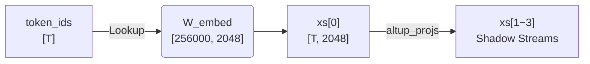
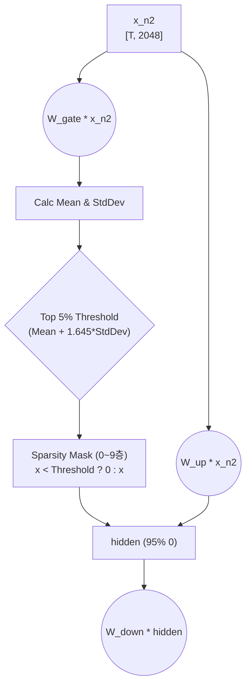

# Gemma 3N E4B Forward Pass: 하드웨어(CPU/IGPU) 분배 및 코드 매핑

이 문서는 Gemma3N-E4B(Int4) 모델에 "안녕하세요" 라는 텍스트가 입력되어 처리되는 전체 Forward Pass 과정을 다룹니다.    

## Phase 1: 입력 및 임베딩 처리

### 1. 토큰화 (Tokenize) 및 가중치 로드 : CPU

**동작** : AI는 한글을 직접 못 읽으므로, 입력 텍스트 "안녕하세요"를 자기가 아는 정수 ID 번호표로 바꿉니다. ("안녕" -> 4512번, "하세요" -> 8931번 등). 단순한 사전 검색 작업이라 CPU가 처리합니다.

* 사람이 쓰는 자연어(글자)는 디지털 연산(ALU/MAC)이 처리할 수 있는 고유한 숫자(ID)로 행렬 곱셈을 할 수 있게 변환한다, 
* 모델이 미리 학습해둔 25만 개의 단어 사전인 json과 대조해서 고유 번호를 부여하는 필수 전처리 과정이다.

**Shape** : token_ids: [T] (1차원 배열, 여기서  $T$  는 토큰 수)

```python
prompt = "안녕 하세요"
input_tokens = CPU_CORE.tokenize(prompt)
```

### 2. 임베딩 (Embedding) 및 AltUp 초기화 : CPU / IGPU

**동작**: 해당 번호를 거대한 사전에서 찾아 긴 숫자 배열(벡터) 로 바꿉니다. 그리고 Gemma 3N E4B의 핵심인 **AltUp 4-Stream** 구조를 위해, 입력된 데이터를 4개의 다중 스트림(`xs[0]`~`xs[3]`)으로 분할(Projection)합니다.

* 단순한 정수 ID(예: 4512)를 2048개의 소수점으로 이루어진 연속적인 수치(벡터) 로 변환하고, 이를 4개의 병렬 스트림으로 복제 및 투영시킨다.  
> 단일 스트림으로 연산하는 것보다, 여러 스트림으로 쪼개서 각기 다른 관점의 정보를 담아두면 훨씬 적은 파라미터로도 모델의 표현력이 대폭 상승하기 때문이야.

**Shape** : xs: [4, T, 2048]



```python
x = CPU_CORE.embedding(token_id, W_embed)

# 4개의 다중 스트림(xs[0]~xs[3]) 초기화
xs = np.zeros((4, x.shape[-1]), dtype=np.float32)
xs[0] = x
for k in range(3):
    xs[k + 1] = hw_matmul(x, altup_projs[k])
```

**수학식** :  

$$
\mathbf{xs}[0] = W_{embed}[\text{token\_ids}]
$$  

## Phase 2: Transformer Block (35번 반복 시작)

매 레이어마다 아래의 파이프라인이 정확히 **35번 반복** 됩니다.

```python
for i in range(35):
    # [A] Attention Block 시작
```

### 3. AltUp Router (Tanh 기반 혼합) : IGPU

**동작** : 4개의 다중 스트림(Main 1개 + Shadow 3개)을 섞어 temporal stream(`xs_pred[0]`)을 만듭니다. 이때 Softmax가 아닌 **Tanh** activation function을 사용하는 것이 핵심입니다.

* 각 스트림의 데이터를 Tanh를 통과한 weight 곱해서 섞어줘(Mixing).
> Tanh로 scaling할 경우 gradient 부드러워지고 안정적으로 섞이거든. 이때 만들어진 `xs_pred[0]`은 메인 연산(Attn/FFN)에 들어가지 않고, 나중에 residual-network 위한 '임시 렌즈'로만 쓰여. 진짜 연산은 오직 순수한 `xs[0]`만 들어가는 점이 중요해!

```python
    modalities = get_router_modalities(xs[0], W["altup_rn"][i], W["altup_router"][i])
    coef_mat = np.dot(W["altup_pred"][i], modalities).reshape(4, 4)

    # xs_pred[0]은 임시 렌즈 (나중에 Residual 계산에 사용)
    xs_pred = xs + np.dot(coef_mat, xs)
```

### 4. Pre-Attention RMSNorm & Q,K,V 계산 : `IGPU`

**동작 (RMSNorm & 하드웨어 가속기)** : AI가 데이터 크기에 휘둘리지 않게 볼륨을 평준화합니다. `ACCEL_MODE = "IGPU"` 환경에 맞춰 rms_norm과 hw_matmul을 분리하여 sequential하게 호출 합니다.

```python
    # Attention 연산은 무조건 순수한 xs[0]이 담당!
    inputs_normalized = rms_norm(xs[0], W["input_ln"][i])

    Q = hw_matmul(inputs_normalized, W["W_q"][i])
    K = hw_matmul(inputs_normalized, W["W_k"][i])
    V = hw_matmul(inputs_normalized, W["W_v"][i])
```

### 5. QK-Norm & RoPE : CPU

**동작** : 거대한 행렬 곱셈 후 튀어버릴 수 있는 Q와 K의 크기를 한 번 더 정규화합니다. 이후 RoPE를 적용하여 단어의 상대적 위치 정보를 각도($\theta$ )로 주입합니다.

**주의사항** : 층마다  $\theta$  값이 번갈아 적용됩니다. 
> Local 레이어: 10,000 
> Global 레이어: 1,000,000

```python
    Q, K = CPU_CORE.cpu_qk_norm(Q, K, W["gamma_q"][i], W["gamma_k"][i])

    theta = 1_000_000.0 if (i % 5 == 4) else 10_000.0
    Q = CPU_CORE.cpu_rope(Q, pos=pos, theta_base=theta)
    K = CPU_CORE.cpu_rope(K, pos=pos, theta_base=theta)
```

### 6. KV 캐시 (KV Cache) 라우팅 및 무스케일(Unscaled) GQA : CPU

**동작** : 20층부터 34층까지는 **자신의 KV 캐시를 업데이트하거나 사용하지 않고** , 18층(Local)과 19층(Global)의 캐시를 **강제로 끌어다 씁니다.** 또한 어텐션 스코어를 계산할 때  $\sqrt{256}$  **으로 나누는 스케일링 과정을 완전히 생략** 합니다.

**무엇을** : 후반부 레이어(20~34층)에서는 캐시를 저장하지 않고 18층과 19층 창고에서 꺼내와 연산해. 이때 Q와 K의 내적 결과값을 차원의 제곱근으로 나누지 않고 바로 Softmax에 태워.
**왜 (캐시 라우팅)** : 극단적인 VRAM 절약을 위한 수술 기법이야. 딥 레이어로 갈수록 Attention 패턴이 고착화되는 성질을 이용해서 가장 잘 학습된 18/19층의 캐시를 빌려 써.
**왜 (무스케일 어텐션)** : Gemma 3N 구조의 핵심 규칙으로, Softcap이나 스케일링을 없애고 날것의 점수(Raw Score)를 사용해 모델의 표현력을 극대화하기 때문이야.

```python
    # 0~19층: 정상적으로 자기 층의 KV를 캐시에 업데이트
    # 20~34층: 새로 저장 안 함! 앞선 층의 캐시를 강제로 끌어옴!
    if i < 20:
        CPU_CORE.cpu_update_kv_cache(K, V, i, K_cache, V_cache)
        target_k_cache = K_cache[i]
        target_v_cache = V_cache[i]
    else:
        if i % 5 == 4:
            target_k_cache = K_cache[19] # Global
            target_v_cache = V_cache[19]
        else:
            target_k_cache = K_cache[18] # Local
            target_v_cache = V_cache[18]

    # 주의: cpu_gqa 내부에서는 sqrt(256)으로 절대 나누지 않음!
    attn_raw = CPU_CORE.cpu_gqa(Q, target_k_cache, target_v_cache)
```

### 7. Output Projection, LAuReL 병렬 연산 및 1차 잔차 연결 : IGPU

**동작** : GQA 결과를 프로젝션하는 동시에, **LAuReL 모듈을 병렬로 연산** 하여 결과를 더해줍니다. 이후 최종 합산값을  $1 / \sqrt{2.0}$  비율로 스케일링하여 잔차 연결을 마무리합니다.

```python
    attn_output = hw_matmul(attn_raw, W["W_o"][i])
    
    # LAuReL 연산 (Attention과 병렬 실행)
    laurel_x = np.dot(inputs_normalized, W["laurel_left"][i])
    laurel_x = np.dot(laurel_x, W["laurel_right"][i])
    laurel_out_normed = inputs_normalized + rms_norm(laurel_x, W["laurel_norm"][i])

    # Attention 결과 정규화 및 잔차 연결, 그리고 LAuReL 합산 및 스케일링
    attn_output = rms_norm(attn_output, W["post_attn_ln"][i])
    attn_output += xs[0]
    attn_output = (attn_output + laurel_out_normed) * (1.0 / math.sqrt(2.0))
```

### [FFN (Feed-Forward Network) 블록]

### 8. FFN 5% 극단적 희소성 (Sparsity) 수술 부위 (0~9층) : IGPU / CPU

**동작**: 0층부터 9층까지는 FFN의 Gate 출력 중 상위 5%만 살리고 나머지 95%는 강제로 날려버립니다 (0으로 만듦).

 **무엇을 & 왜 하는 건가요?**

**무엇을** : 0~9층에서 Gate 활성화 값의 평균과 표준편차를 구해서 가우시안 통계(Threshold =  $ \mu + 1.645 \cdot \sigma $ )를 낸 뒤, 이 문턱을 넘는 상위 5%의 뉴런만 남겨둬.
**왜**: NPU/IGPU에서 연산량을 획기적으로 줄이기 위해서야. 초반 레이어는 불필요한 노이즈가 많아서 95%를 날려버려도 성능 저하가 없고 연산 속도는 엄청나게 빨라지거든. 



```python
    x_n2 = rms_norm(attn_output, W["pre_ffn_ln"][i])

    if i < 10:  
        # 0~9층: GeLU 융합 끄고 "순수 행렬곱" 값만 가져옴
        gate_out = hw_matmul(x_n2, W["W_gate"][i], use_gelu=False)
        up_out   = hw_matmul(x_n2, W["W_up"][i])
        
        # 순수 값으로 5% 커트라인 계산
        cutoff = np.mean(gate_out) + np.std(gate_out) * 1.6448536
        sparse_gate = np.maximum(gate_out - cutoff, 0.0) 
        
        hidden = CPU_CORE.gelu(sparse_gate) * up_out
    else:
        # 10층 이후: 커트라인 없이 초고속 GeLU 융합 커널 사용
        gate_out = hw_matmul(x_n2, W["W_gate"][i], use_gelu=True)
        up_out   = hw_matmul(x_n2, W["W_up"][i])
        hidden = gate_out * up_out

    mlp_out = hw_matmul(hidden, W["W_down"][i])
```

### 9. 잔차 연결 및 AltUp 렌즈 반영 : IGPU

```python
    outputs = rms_norm(mlp_out, W["post_ffn_ln"][i])
    outputs += attn_output
```

### 10. PLE 주입 (그림자 스트림 전용) : CPU

**동작** : 레이어의 가장 마지막 단계에서, 현재 레이어 번호 정보를 담은 PLE를 주입합니다. 단, **절대 메인 스트림(`xs[0]`)에 넣지 않고 오직 그림자 스트림(`xs[1~3]`)에만 선택적으로 넣는 것** 이 핵심입니다.

 **무엇을 & 왜 하는 건가요?**

**무엇을** : 레이어 시작부가 아닌 맨 끝에서, `xs[1]`, `xs[2]`, `xs[3]` 에만 PLE 벡터를 더해줘.
**왜** : 메인 연산 경로(Attn/FFN)의 순수성은 유지하면서, 뒤에 숨어다니는 그림자 스트림들이 "아 우리가 지금 몇 층을 지나는구나" 하고 컨텍스트를 기억하게 만드는 매우 교묘한 설계야.

```python
    activated = outputs * W["altup_scale"][i]
    innovation = activated - xs_pred[0]
    
    mod_corr = get_router_modalities(activated, W["altup_rn"][i], W["altup_router"][i])
    corr_coefs = np.dot(W["altup_corr"][i], mod_corr) + 1.0

    xs_new = xs_pred.copy()
    for k in range(4):
        xs_new[k] = xs_pred[k] + corr_coefs[k] * innovation

    # [핵심] PLE는 레이어 맨 마지막에 그림자 스트림(xs[1~3])에만 주입!
    pli = pli_all[i]
    gate_ple = CPU_CORE.gelu(np.dot(activated, W["ple_gate"][i])) * pli
    mapped = rms_norm(np.dot(gate_ple, W["ple_proj"][i]), W["ple_post_ln"][i])
    
    # xs[0]은 건드리지 않고 1, 2, 3번 스트림에만 더함
    for k in range(1, 4):
        xs_new[k] += mapped

    xs = xs_new
```

*(여기까지의 과정을 35개 레이어에 걸쳐 반복합니다.)*

## [NEW] INT4 양자화 및 메모리 최적화 (E4B_INT4_MODEL_INFER)

Gemma 3N E4B 모델을 모바일/엣지 디바이스나 RAM 제한이 엄격한 환경(예: 800MB 수준의 RAM 환경)에서 구동하기 위해, 강력한 **INT4 양자화(Quantization) 및 메모리 구조화 기법**이 적용되었습니다 (`Master/newp/E4B_INT4_MODEL_INFER` 폴더 참조).

### 1. INT4 가중치 패킹 (Weight Packing)
메모리 절약을 위해 거대한 가중치 행렬들은 INT4 형태로 압축됩니다. 메모리에는 4비트 자료형이 없기 때문에, **두 개의 INT4 가중치를 하나의 8비트 정수(`uint8`)로 패킹**하여 저장합니다 (상위 4비트, 하위 4비트).
이를 통해 가중치 행렬의 크기가 정확히 절반(`K_in // 2`)으로 줄어들어 VRAM 사용량이 획기적으로 감소합니다.
추론(Forward Pass) 시 하드웨어(CPU/IGPU) 코어 내부에서 비트 연산(`& 0x0F`, `>> 4`)을 통해 실시간으로 압축을 풀고, 저장된 `Scale` 값을 곱해 Float32로 복원(Dequantize)하여 행렬 곱을 수행합니다.

### 2. 메모리 맵(Mmap) 기반 부분 로딩: `W_embed` & `W_ple`
입력 프롬프트를 처리할 때, 26만 개가 넘는 거대한 사전 크기를 가진 `W_embed`(임베딩)와 `W_ple`를 한 번에 RAM에 올리면 메모리가 터집니다(OOM).
이를 방지하기 위해 **Mmap(메모리 맵핑)** 기술을 활용합니다. 전체 가중치를 메모리에 로드하지 않고 디스크에 매핑해둔 뒤, 모델이 현재 처리 중인 `token_id`에 해당하는 **단 한 줄의 가중치(약 1KB ~ 4.5KB)**만 디스크에서 즉시 읽어옵니다.

```python
# Phase 1: W_embed 디스크에서 딱 1KB만 로드
x0 = CPU_CORE.embedding(safe_token_id, W_embed[0], W_embed[1])

# Phase 1.5: W_ple 디스크에서 딱 4.5KB만 로드
unpacked_w_ple = CPU_CORE.embedding(safe_token_id, W_ple_packed, W_ple_scale)
```

### 3. Logit Softcapping (오버플로우 방지 및 안정성)
최종 단계에서, 모델 출력의 불안정성을 잡고 환각 현상을 억제하기 위해 **Gemma 3 전용 Final Logit Soft-capping 기법**이 부활했습니다.
출력 값(Logits)이 너무 커지는 것을 방지하기 위해 `30.0`을 기준으로 `Tanh` 함수를 씌워 값을 억제합니다.

```python
#  [핵심] Gemma 3 전용 Final Logit Soft-capping (30.0)
logits = 30.0 * np.tanh(logits / 30.0)
```
이 한 줄의 코드가 모델의 문법적 지능을 비약적으로 끌어올리고, 루프에 빠지는 현상(Repetition)을 절대적으로 방어합니다.

---

## Phase 3: 최종 출력 (대답 내놓기)

### 11. Final RMSNorm & LM Head : IGPU

**동작** : 35번 레이어를 통과해 고도로 압축된 4개의 스트림을 하나로 결합한 뒤, 전체 단어 사전 크기(25만 개)로 다시 비교합니다. **Softcap 등 어떠한 스케일링 제약도 두지 않고 날것의 점수(Logits)를 구하는 것** 이 중요합니다.

```python
def decode_logits(xs, altup_unprojs, W_final_norm, W_lm_head):
    target_mag  = np.mean(xs[0] ** 2) ** 0.5
    unembedded  = [xs[0]]
    for k in range(3):
        proj_x  = np.dot(xs[k + 1], altup_unprojs[k])
        new_mag = np.mean(proj_x ** 2) ** 0.5
        proj_x *= target_mag / max(new_mag, 1e-12)
        unembedded.append(proj_x)

    # 4개의 스트림 평균내서 통합
    x_final = np.mean(np.stack(unembedded, axis=0), axis=0)
    
    x_final = rms_norm(x_final, W_final_norm)
    logits  = np.dot(x_final, W_lm_head)
    
    # Softcap 없음! 바로 최댓값만 빼서 오버플로우 방지
    logits -= np.max(logits)
    return logits
```

**수학식**:

$$
\mathbf{logits} = \text{RMSNorm}(\mathbf{x}_{final}) \cdot W_{lm\_head}
$$

### 12. Softmax 및 토큰 샘플링 : CPU

**동작**: 점수들을 확률로 바꾸고, 반복 패널티 등을 적용하여 최종 단어를 선택합니다. 뽑힌 단어는 다시 Phase 1의 입력으로 들어가 꼬리를 뭅니다(Autoregressive).

```python
    next_token = _sample(logits, TEMPERATURE, TOP_P, REP_PENALTY, generated)
    decoded = CPU_CORE.tokenizer.decode([next_token])
    print(decoded, end="", flush=True)
```
