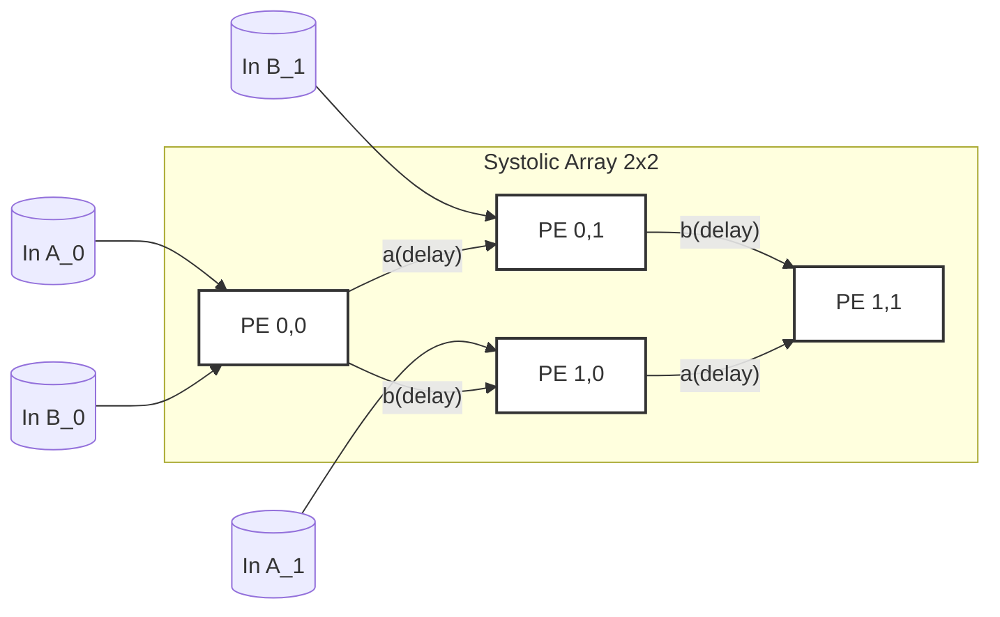
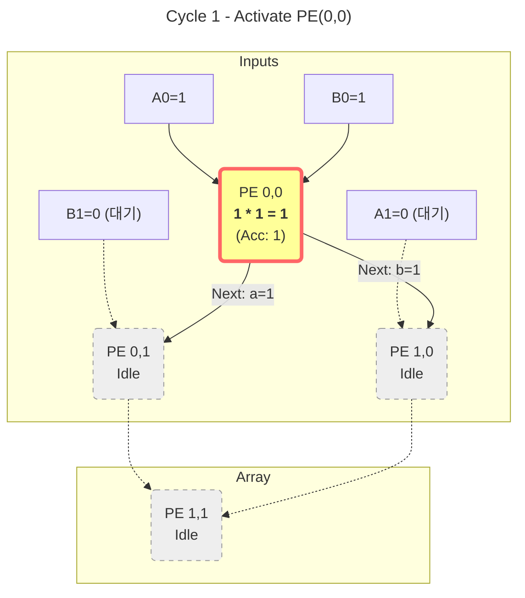
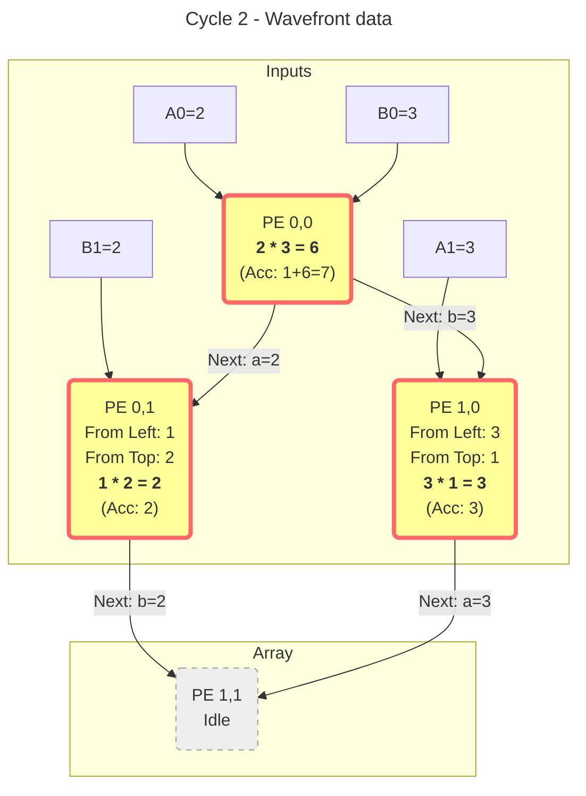
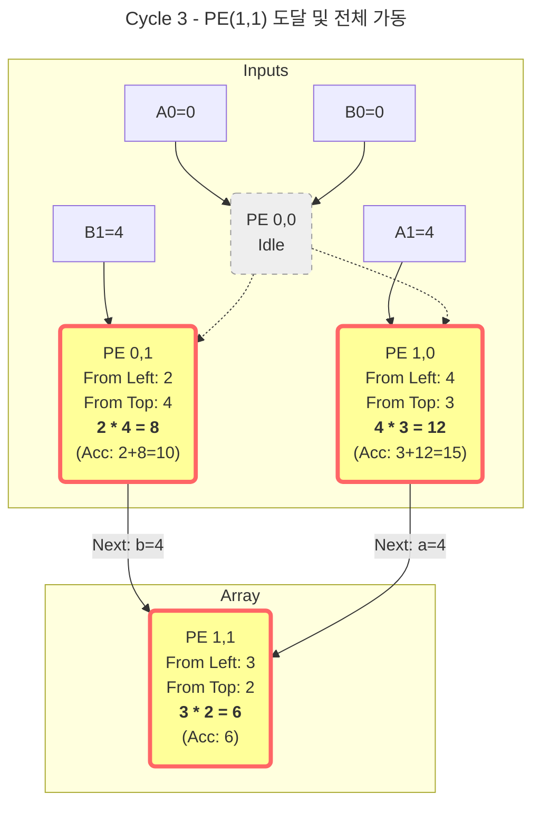
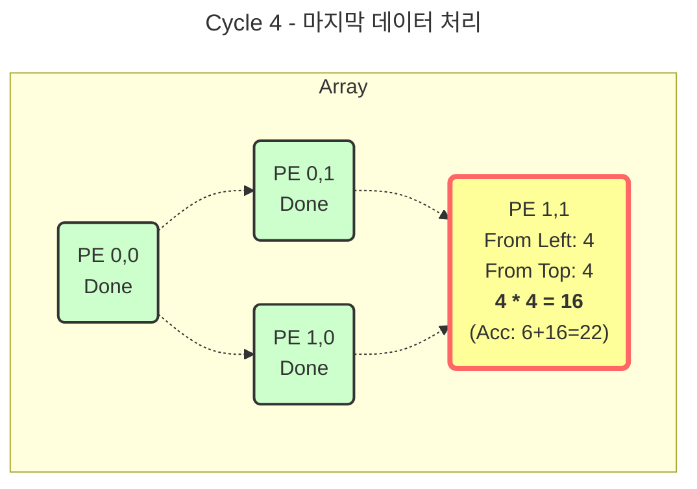

# 1. Structure and connection

# 2. Step-by-Step Execution

<ul> <h3>Cycle 1: 첫 번째 파동 (Start)    </h3>  
<li>Input: in_a_0=1, in_b_0=1  (in_a_1, in_b_1 are yet 0)  </li>
<li>Run: only **PE(0,0)** begin operation. other PE's wait for signal</li>
</li>
</ul>

<ul> <h3>Cycle 2: 확산 (Propagation)  </h3>  
<li>Input: in_a_0=2, in_b_0=3 (두 번째 데이터), in_a_1=3, in_b_1=2 (첫 번째 데이터가 지연되어 도착)  </li>
<li>Pass Data: PE(0,0)이 아까 쓴 a=1, b=1을 각각 오른쪽(PE01)과 아래쪽(PE10)으로 넘겨줍니다.</li>
<li>Run: 이제 PE(0,0)(2차 연산), PE(0,1), PE(1,0) 세 곳에서 동시에 불이 켜집니다.
</li>
</ul>

<ul> <h3> Cycle 3: 수렴 (Convergence)  </h3>  
<li>입력: in_a_1=4, in_b_1=4 (마지막 데이터)</li>
<li>전달: PE(0,1)과 PE(1,0)이 처리한 데이터들이 **PE(1,1)**로 모입니다.</li>
<li>동작: 드디어 **PE(1,1)**이 첫 연산을 시작합니다. 나머지 PE들도 계속 연산을 수행합니다.
</li>
</ul>

---

<ul> <h3>Cycle 4: 마무리 (Tail) </h3>  
<li>입력: 데이터 주입 끝 (Valid Off).</li>
<li>동작: 파이프라인에 남아있는 마지막 데이터들이 **PE(1,1)**에서 처리됩니다.</li>
</ul>

# Summary
1. Cycle 1: (0,0) start
2. Cycle 2: (0,0) second operation  + (0,1), (1,0) first operation (data pass)
3. Cycle 3: (0,1), (1,0) second operation + (1,1) first operation
4. Cycle 4: (1,1) second operation