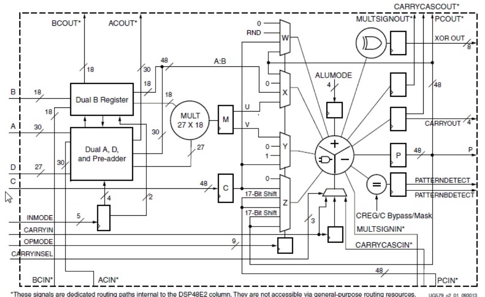

# TinyNPU-Gemma: Bare-Metal Gemma 3N LLM Accelerator on FPGA

## Project Overview

TinyNPU-Gemma is a custom SystemVerilog-based Neural Processing Unit (NPU) engineered specifically to accelerate a quantized Gemma 3N (E2B/E4B) Large Language Model on the Xilinx Kria KV260 FPGA. The architecture is meticulously designed to push the physical constraints of the KV260 platform, which is equipped with 1,248 DSP48E2 slices and 144 Block RAMs (BRAMs).

This project encompasses a full-stack hardware-software co-design approach, integrating a SystemVerilog hardware accelerator, Python-based Golden Models for Trace-Driven Verification, CPU SIMD optimizations, and a high-performance AXI Direct Memory Access (AXI DMA) pipeline.

## System Architecture and Components

### 1. SystemVerilog NPU and Hardware Acceleration

The core of the accelerator is implemented in SystemVerilog, featuring a highly optimized **32x32 Systolic Array MAC Engine**. This engine is tailored to maximize the utilization of the Xilinx DSP48E2 slices, executing low-precision INT8/INT4 matrix multiplications with high throughput.

To alleviate memory bandwidth bottlenecks, the NPU employs **Dual-Port Ping-Pong BRAMs** with a 512-bit wide data path. This configuration packs the upper 256-bit weights and lower 256-bit activations, enabling parallel read and write operations that perfectly hide memory copy latency behind hardware computation time.

Furthermore, custom hardware accelerators have been developed for critical non-linear functions:
*   **RMSNorm Accelerator:** Executes in 1 clock cycle.
*   **GeLU Accelerator:** Executes in 1 clock cycle.
*   **Softmax Accelerator:** Executes in 3 clock cycles.

### DSP48E2 Architecture Utilization

The Systolic Array heavily relies on the DSP48E2 blocks to perform multiply-accumulate (MAC) operations efficiently.

*Figure 1: Internal architecture of the DSP48E2 slice utilized for the Systolic Array MAC Engine.*

### 2. AXI Direct Memory Access (AXI DMA)

Data movement between the Processing System (PS) and Programmable Logic (PL) is orchestrated via a high-performance **AXI DMA** interface. The DMA engine manages high-speed, zero-copy data transfers between the host CPU memory and the NPU's internal BRAMs. By utilizing stream-based communication, the AXI DMA ensures that the Systolic Array is continuously fed with weights and activations, preventing pipeline stalls and reaching the physical memory bandwidth limits of the system.

### 3. CPU SIMD Optimizations and Python Golden Model

The software stack includes a highly optimized Python environment responsible for model quantization, preprocessing, and trace generation.
To accelerate software-side preprocessing and inference emulation, we leverage **CPU SIMD (Single Instruction, Multiple Data)** instructions and vectorized memory access patterns.

The bit-width strategy utilizes INT8/INT4 quantization for inputs and weights, maintaining intermediate 16-bit or 32-bit accumulation to prevent overflow before requantization.

Hardware verification relies strictly on **Trace-Driven Verification**, requiring a bit-true match (0% error rate) between the SystemVerilog RTL simulation and a Python (NumPy/PyTorch) golden model.

### 4. Gemma 3N Architecture Specifics

The accelerator is specifically tuned for the idiosyncratic architectural features of the Gemma 3N E4B/E2B model:

*   **AltUp Router:** The router mixes four multi-streams (xs[0] to xs[3]). It applies a hyperbolic tangent scaling scaled by dimension (Tanh(Norm(x)/2048)*W), leaving the main stream (xs[0]) untouched.
*   **RMSNorm Optimization:** The RMSNorm implementation enforces scale_plus_one=False, ensuring no arbitrary +1.0 is added to the weights, strictly conforming to the Gemma specification.
*   **Top-K Extraction:** The software stack employs numpy.argpartition instead of numpy.argsort for Top-K extraction during sequence generation. This reduces algorithmic complexity from O(N log N) to O(N), significantly enhancing generation speed.
*   **Gaussian Top-K Sparsity:** Feed-Forward Network (FFN) layers 0-9 apply Gaussian Top-K Sparsity (0.95), effectively zeroing out the bottom 95% via ReLU to induce sparse activation.
*   **Cache Reusability:** Layers 20-34 bypass local KV cache updates, forcefully reusing caches from Layer 18 (Local) and Layer 19 (Global) to drastically reduce memory footprint.

## Verification and Testing

All hardware modules have been verified via Trace-Driven Verification. The verification suite ensures bit-exact equivalence between the Python Golden Model and the SystemVerilog RTL output.

## Future Work

Future revisions will focus on deploying the synthesized RTL on the physical Xilinx Kria KV260 board, integrating bare-metal C++ drivers to manage the AXI DMA pipeline, and evaluating end-to-end inference latency.