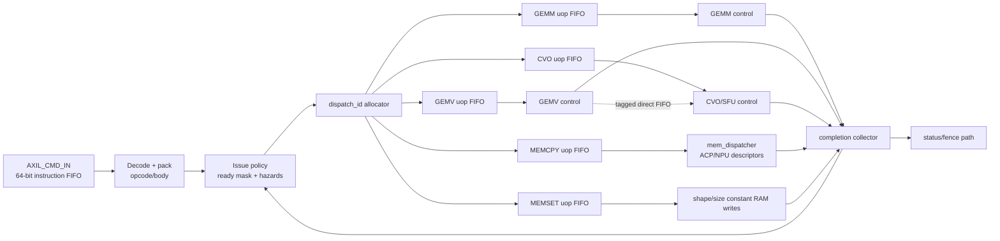

# v002.1 Dispatcher Redesign Proposal: Decoupled Uop FIFOs

Issue: #38
Scope: design proposal only. This document does not change RTL.

## Claim Guard

This proposal is for architecture review before implementation. It makes no
claim that decoupled dispatcher FIFOs are implemented, verified, timing-clean,
or safe to merge into the runtime path. The `human-review-required` label on
issue #38 is treated as binding: all decisions marked below require architecture
lead confirmation before any RTL change.

## Source Snapshot

The issue title names `ctrl_npu_dispatcher.sv`, but that file is not active in
the current RTL tree. The current dispatch behavior is split across the
AXI-Lite command FIFO, opcode decoder, `Global_Scheduler`, top-level wiring,
and memory dispatcher. The local dead-module inventory records the old
`NPU_Controller/NPU_Control_Unit/ctrl_npu_dispatcher.sv` as zero active
SystemVerilog and says the dispatch role moved to `Global_Scheduler.sv`
(`docs/internal/dead_module_inventory.md:137-144`).

## Current Dispatcher Architecture

The current control path is serial at the ISA front end and mostly
level-driven after decode:

```text
AXI-Lite write
  -> AXIL_CMD_IN 8-entry command FIFO
  -> ctrl_npu_frontend OUT_kick
  -> ctrl_npu_decoder opcode valid pulse
  -> Global_Scheduler registered uops
  -> NPU_top direct wires to engines / mem_dispatcher
```

Key RTL facts:

| Area | Current behavior | RTL source |
|---|---|---|
| Host command buffering | `AXIL_CMD_IN` accepts AXI-Lite writes into an 8-entry `IF_queue`; it pops only when `OUT_valid && IN_decoder_ready`. | `hw/rtl/NPU_Controller/NPU_frontend/AXIL_CMD_IN.sv:6-19`, `124-150` |
| Frontend kick | `ctrl_npu_frontend` drives the raw 64-bit instruction and asserts `OUT_kick = cmd_valid & IN_fetch_ready`. | `hw/rtl/NPU_Controller/NPU_frontend/ctrl_npu_frontend.sv:56-58` |
| Controller wrapper | `npu_controller_top` connects the frontend directly to `ctrl_npu_decoder`; status feedback into the frontend is tied off. | `hw/rtl/NPU_Controller/npu_controller_top.sv:49-82` |
| Opcode decode | `ctrl_npu_decoder` strips opcode bits `[63:60]`, emits one-cycle valid pulses for GEMV/GEMM/MEMCPY/MEMSET/CVO, and drops unknown opcodes silently. | `hw/rtl/NPU_Controller/NPU_Control_Unit/ctrl_npu_decoder.sv:59-88` |
| ISA vocabulary | Five opcodes are defined today: GEMV `0x0`, GEMM `0x1`, MEMCPY `0x2`, MEMSET `0x3`, CVO `0x4`. Existing uop structs cover GEMM, GEMV, memory, MEMSET, and CVO. | `hw/rtl/NPU_Controller/NPU_Control_Unit/ISA_PACKAGE/isa_pkg.sv:92-99`, `213-253` |
| Uop construction | `Global_Scheduler` casts the 60-bit body into per-opcode views and registers uops in independent always_ff blocks. | `hw/rtl/NPU_Controller/Global_Scheduler.sv:58-86`, `179-218` |
| Shared load uop | `OUT_LOAD_uop` has one registered driver with priority `GEMM > GEMV > MEMCPY > CVO`; `OUT_sram_rd_start` pulses for GEMM/GEMV. | `hw/rtl/NPU_Controller/Global_Scheduler.sv:98-145` |
| Store uop | `OUT_STORE_uop` is latched at issue time for GEMM/GEMV/CVO, but current top-level wiring does not expose a generic store-completion handshake. | `hw/rtl/NPU_Controller/Global_Scheduler.sv:147-177`, `hw/rtl/NPU_top.sv:103-131` |
| Top-level wiring | `NPU_top` wires scheduler outputs directly to `mem_dispatcher`, GEMM, GEMV, and CVO without per-engine uop FIFOs. | `hw/rtl/NPU_top.sv:86-168`, `229-356`, `368-400` |
| Memory dispatch | `mem_dispatcher` converts LOAD uops into ACP/NPU descriptors, has shape RAM handling for MEMSET, and gives CVO bridge priority on L2 port B while CVO is busy. | `hw/rtl/MEM_control/top/mem_dispatcher.sv:8-35`, `194-291`, `306-380` |
| Existing decoupling | Only the memory ACP/NPU descriptor path already has independent FIFOs (`xpm_fifo_sync`, depth 128, prog-full threshold 100). These FIFOs protect memory descriptors, not the opcode-to-engine issue boundary. | `hw/rtl/MEM_control/IO/mem_u_operation_queue.sv:8-27`, `69-130` |
| Backpressure gap | `mem_u_operation_queue` has sim-only assertions for push while full, but its full signals are not fed back into `ctrl_npu_decoder` issue gating. | `hw/rtl/MEM_control/IO/mem_u_operation_queue.sv:182-201`, `hw/rtl/NPU_top.sv:393-400` |
| CVO readiness gap | `CVO_top` exposes `OUT_uop_ready`, but `NPU_top` leaves it unconnected; `mem_CVO_stream_bridge` latches a CVO uop only from IDLE. | `hw/rtl/CVO_CORE/CVO_top.sv:46-50`, `150-225`; `hw/rtl/NPU_top.sv:368-376`; `hw/rtl/MEM_control/top/mem_CVO_stream_bridge.sv:37-41`, `155-173` |

The canonical v002 docs describe the intended architecture as a Dispatcher
that broadcasts uops to GEMM, GEMV, SFU, and DMA back ends
(`pccx/docs/v002/Architecture/top_level.rst:19-27`)
and state that instruction decode and execution should be separated by a FIFO
(`pccx/docs/v002/Architecture/top_level.rst:37-39`).
The current RTL has the host command FIFO and memory descriptor FIFOs, but not
per-engine dispatcher FIFOs at the issue boundary.

## Proposed Decoupled-FIFO Architecture

Introduce a dispatcher boundary that accepts raw decoded instructions only when
all required downstream enqueue targets can accept the instruction atomically.
The dispatcher should own opcode decode, uop packing, FIFO push policy,
instruction IDs, invalid-opcode handling, and hazard gating.



Recommended logical channels:

| Channel | Payload | Notes |
|---|---|---|
| GEMM | `{dispatch_id, gemm_control_uop_t, load_uop, store_uop}` | Enqueue atomically so the engine command, activation load, and result writeback cannot diverge. |
| GEMV | `{dispatch_id, gemv_control_uop_t, load_uop, store_uop, direct_sfu_tag}` | `gemv_control_uop_t` should be a lowercase type alias or replacement for current `GEMV_control_uop_t` if the project standardizes type names. |
| CVO | `{dispatch_id, cvo_control_uop_t, source_select, store_policy}` | `source_select` distinguishes L2 stream from GEMV direct FIFO. |
| MEMCPY | `{dispatch_id, memory_control_uop_t}` | Keeps host-to-L2 and L2-to-host traffic independent from compute uop readiness. |
| MEMSET | `{dispatch_id, memory_set_uop_t}` | Writes constant/shape state in order relative to later consumers. |
| Completion | `{dispatch_id, opcode, status, async}` | Feeds status, synchronous fences, and hazard scoreboard release. |

Backpressure rule:

1. Decode may look at the command FIFO head without popping it.
2. The dispatcher computes the full enqueue set for that opcode.
3. Pop and enqueue occur only when every required FIFO has space and the
   hazard scoreboard permits issue.
4. If the opcode is invalid, apply the selected invalid-opcode policy without
   changing engine-visible state.

This avoids the current pattern where `ctrl_npu_decoder` is always ready and
downstream readiness is only surfaced as status bits or memory-queue warnings.

## Architecture Decisions Requiring Confirmation

[CONFIRM] C01: Reintroduce the implementation file as
`hw/rtl/NPU_Controller/NPU_Control_Unit/ctrl_npu_dispatcher.sv`, or evolve
`Global_Scheduler.sv` in place and keep the historical filename retired?

[CONFIRM] C02: Use one FIFO per ISA opcode (GEMM, GEMV, CVO, MEMCPY, MEMSET),
or one FIFO per physical backend plus sideband routes for memory load/store?

[CONFIRM] C03: Pick initial FIFO depths and programmable-full thresholds. A
conservative starting point is 8 entries for compute/control uops and 32 or 128
entries for memory descriptors, but this needs timing/resource review.

[CONFIRM] C04: Select invalid/reserved opcode behavior: silent drop for
compatibility, sticky fault in status, completion event with error code, or
simulation-fatal only.

[CONFIRM] C05: Define whether dispatcher backpressure stalls at the AXI-Lite
command FIFO head, or accepts commands into a larger internal instruction FIFO
before hazard/ready gating.

[CONFIRM] C06: Confirm atomic enqueue semantics for multi-uop instructions,
especially GEMM/GEMV `{engine, load, store}` and CVO `{engine, L2 stream,
store/result}` bundles.

[CONFIRM] C07: Choose `dispatch_id` width, wrap behavior, and whether ID `0`
is legal. The width must cover the maximum number of in-flight async operations.

[CONFIRM] C08: Define synchronous fence semantics for `async = 0`: block
younger issue globally, block only hazards on the same resource/address, or
translate sync into a host-visible wait on completion status.

[CONFIRM] C09: Define the first hazard scoreboard scope: resource-only,
address-range RAW/WAR/WAW, shape/size pointer dependency, or all of the above.

[CONFIRM] C10: Define GEMV-to-SFU direct FIFO override/tag behavior: how a CVO
instruction selects GEMV direct data, how the producer/consumer IDs match, and
what happens if the direct FIFO is empty/full.

[CONFIRM] C11: Decide whether result writeback remains owned by each backend
bridge, or whether dispatcher-created `store_uop` queues become the single
completion-triggered writeback path.

[CONFIRM] C12: Choose one migration cut from the alternatives below before RTL
work starts.

## Migration Risks

### Timing

- More issue-time logic can land on the 400 MHz control path: opcode decode,
  ready-mask reduction, hazard checks, ID allocation, and multi-FIFO enqueue
  gating. Register the decode/pack stage separately from issue-policy gating if
  a one-cycle path is too long.
- Per-engine FIFO signals will add fanout into `NPU_top` and engine wrappers.
  Keep ready/full reductions local to the dispatcher and export only registered
  status/counters.
- A full hazard scoreboard with address comparisons can become wider than the
  current priority LOAD path. Start with resource hazards or a small CAM only if
  the architecture lead confirms the required ordering model.
- CVO/GEMV direct FIFO tagging may create a new long path if tag compare,
  source mux, and SFU ready gating are combined in one cycle.

### Throughput

- The current decoder can issue one opcode-valid pulse per clock when commands
  are available, but downstream engines are not protected by ready/valid
  handshakes. Decoupled FIFOs should preserve one accepted instruction per
  cycle when all target queues have space.
- Atomic multi-uop enqueue can reduce apparent issue rate if any one target
  FIFO is full. This is the intended safety behavior, but queue depth and
  producer scheduling must avoid unnecessary head-of-line blocking.
- MEMCPY traffic should not block GEMM/GEMV control issue once memory hazards
  allow independence. Separate MEMCPY and compute queues are the main
  throughput benefit of this proposal.
- A direct GEMV-to-SFU path improves latency only if its tag/ready policy avoids
  forcing unrelated CVO/L2 operations to wait.

### Hazard Handling

- Shape/size constants are software-managed and loaded by MEMSET. A MEMSET must
  become visible before younger GEMM/GEMV/MEMCPY instructions that use the same
  pointer.
- L2 address hazards need at least RAW/WAW protection across MEMCPY, GEMM/GEMV
  activation loads, CVO reads/writes, and result stores.
- Resource hazards must account for single-instance blocks: current CVO has one
  SFU wrapper and one CVO stream bridge; GEMM has one systolic top; memory has
  shared ACP/NPU descriptor paths and L2 port-B arbitration.
- Async completion must release both resource reservations and address
  reservations. A missing completion event would otherwise deadlock the
  scoreboard.
- Invalid opcode and FIFO-full behavior must be observable in simulation and
  status. Silent drops make backpressure bugs hard to distinguish from legal
  no-ops.

## Alternative Cuts

### 1. Minimal Change

Add shallow valid/ready FIFOs around the existing `Global_Scheduler` outputs
and plumb ready back to `ctrl_npu_decoder`.

Trade-offs:

- Lowest churn and easiest to review against current RTL.
- Can close the most obvious ready/valid gaps, including CVO `OUT_uop_ready`.
- Keeps current shared LOAD/STORE model, so atomic multi-uop issue and async
  completion IDs remain partial or bolted on.
- Risk: preserves the split between opcode valid pulses and held uop fields,
  which may leave MEMSET/LOAD validity ambiguous.

### 2. Moderate Refactor

Create a real dispatcher boundary that owns decode, uop packing, per-opcode
FIFOs, ID allocation, and a first hazard scoreboard. Reuse existing `isa_pkg`
types and move `Global_Scheduler` packing logic into helper functions or an
internal pack stage.

Trade-offs:

- Best balance for issue #38: it directly addresses decoupled FIFOs,
  backpressure, invalid opcode policy, async IDs, and GEMV/SFU tag behavior.
- Requires top-level interface changes and focused TBs for opcode decode,
  backpressure, invalid opcode, async completion, and direct FIFO tagging.
- Keeps engine datapaths intact; the main risk is control-plane integration,
  not compute math.
- Recommended cut if architecture lead agrees on the decision markers above.

### 3. Full Rewrite

Replace the current decoder/scheduler/memory-dispatch issue path with a new
typed instruction-issue subsystem: instruction FIFO, decode stage, reorder or
scoreboard table, per-backend request channels, status collector, and explicit
completion protocol.

Trade-offs:

- Cleanest long-term architecture and easiest place to enforce hazards and
  async semantics consistently.
- Highest RTL and verification blast radius; many top-level and TB interfaces
  change at once.
- Timing risk is highest unless the scoreboard and enqueue policy are deeply
  pipelined from the start.
- Not recommended for v002.1 unless the existing path is judged too brittle to
  evolve.

## Suggested Review Outcome

For v002.1, the moderate refactor is the preferred implementation target after
architecture review because it gives issue #38 a real dispatcher boundary
without rewriting GEMM, GEMV, CVO, or memory datapaths. The minimum acceptance
package after approval should include:

- One-hot decode tests for opcodes `0x0` to `0x4`.
- Invalid opcode policy test matching the confirmed behavior.
- Backpressure tests proving no instruction is popped unless every required
  FIFO push can occur.
- Async completion ID tests proving unrelated engines continue issuing while a
  long MEMCPY or CVO is in flight.
- GEMV-to-SFU direct FIFO tag/override tests once C10 is resolved.
